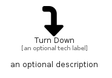

# TurnDown


```text
fontawesome/Solid/TurnDown
```

```text
include('fontawesome/Solid/TurnDown')
```


| Illustration | TurnDown |
| :---: | :---: |
|  |  |


## Sprites
The item provides the following sriptes:

- `<$TurnDownXs>`
- `<$TurnDownSm>`
- `<$TurnDownMd>`
- `<$TurnDownLg>`


## TurnDown

### Load remotely
```plantuml
@startuml
' configures the library
!global $LIB_BASE_LOCATION="https://raw.githubusercontent.com/tmorin/plantuml-libs/master/distribution"

' loads the library's bootstrap
!include $LIB_BASE_LOCATION/bootstrap.puml

' loads the package bootstrap
include('fontawesome/bootstrap')

' loads the Item which embeds the element TurnDown
include('fontawesome/Solid/TurnDown')

' renders the element
TurnDown('TurnDown', 'Turn Down', 'an optional tech label', 'an optional description')
@enduml
```

### Load locally
```plantuml
@startuml
' configures the library
!global $INCLUSION_MODE="local"
!global $LIB_BASE_LOCATION="../.."

' loads the library's bootstrap
!include $LIB_BASE_LOCATION/bootstrap.puml

' loads the package bootstrap
include('fontawesome/bootstrap')

' loads the Item which embeds the element TurnDown
include('fontawesome/Solid/TurnDown')

' renders the element
TurnDown('TurnDown', 'Turn Down', 'an optional tech label', 'an optional description')
@enduml
```

