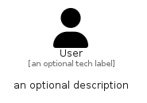

# User


```text
fontawesome/Solid/User
```

```text
include('fontawesome/Solid/User')
```


| Illustration | User |
| :---: | :---: |
|  |  |


## Sprites
The item provides the following sriptes:

- `<$UserXs>`
- `<$UserSm>`
- `<$UserMd>`
- `<$UserLg>`


## User

### Load remotely
```plantuml
@startuml
' configures the library
!global $LIB_BASE_LOCATION="https://raw.githubusercontent.com/tmorin/plantuml-libs/master/distribution"

' loads the library's bootstrap
!include $LIB_BASE_LOCATION/bootstrap.puml

' loads the package bootstrap
include('fontawesome/bootstrap')

' loads the Item which embeds the element User
include('fontawesome/Solid/User')

' renders the element
User('User', 'User', 'an optional tech label', 'an optional description')
@enduml
```

### Load locally
```plantuml
@startuml
' configures the library
!global $INCLUSION_MODE="local"
!global $LIB_BASE_LOCATION="../.."

' loads the library's bootstrap
!include $LIB_BASE_LOCATION/bootstrap.puml

' loads the package bootstrap
include('fontawesome/bootstrap')

' loads the Item which embeds the element User
include('fontawesome/Solid/User')

' renders the element
User('User', 'User', 'an optional tech label', 'an optional description')
@enduml
```

