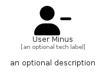

# UserMinus


```text
fontawesome/Solid/UserMinus
```

```text
include('fontawesome/Solid/UserMinus')
```


| Illustration | UserMinus |
| :---: | :---: |
|  |  |


## Sprites
The item provides the following sriptes:

- `<$UserMinusXs>`
- `<$UserMinusSm>`
- `<$UserMinusMd>`
- `<$UserMinusLg>`


## UserMinus

### Load remotely
```plantuml
@startuml
' configures the library
!global $LIB_BASE_LOCATION="https://raw.githubusercontent.com/tmorin/plantuml-libs/master/distribution"

' loads the library's bootstrap
!include $LIB_BASE_LOCATION/bootstrap.puml

' loads the package bootstrap
include('fontawesome/bootstrap')

' loads the Item which embeds the element UserMinus
include('fontawesome/Solid/UserMinus')

' renders the element
UserMinus('UserMinus', 'User Minus', 'an optional tech label', 'an optional description')
@enduml
```

### Load locally
```plantuml
@startuml
' configures the library
!global $INCLUSION_MODE="local"
!global $LIB_BASE_LOCATION="../.."

' loads the library's bootstrap
!include $LIB_BASE_LOCATION/bootstrap.puml

' loads the package bootstrap
include('fontawesome/bootstrap')

' loads the Item which embeds the element UserMinus
include('fontawesome/Solid/UserMinus')

' renders the element
UserMinus('UserMinus', 'User Minus', 'an optional tech label', 'an optional description')
@enduml
```

