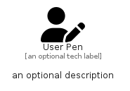

# UserPen


```text
fontawesome/Solid/UserPen
```

```text
include('fontawesome/Solid/UserPen')
```


| Illustration | UserPen |
| :---: | :---: |
|  |  |


## Sprites
The item provides the following sriptes:

- `<$UserPenXs>`
- `<$UserPenSm>`
- `<$UserPenMd>`
- `<$UserPenLg>`


## UserPen

### Load remotely
```plantuml
@startuml
' configures the library
!global $LIB_BASE_LOCATION="https://raw.githubusercontent.com/tmorin/plantuml-libs/master/distribution"

' loads the library's bootstrap
!include $LIB_BASE_LOCATION/bootstrap.puml

' loads the package bootstrap
include('fontawesome/bootstrap')

' loads the Item which embeds the element UserPen
include('fontawesome/Solid/UserPen')

' renders the element
UserPen('UserPen', 'User Pen', 'an optional tech label', 'an optional description')
@enduml
```

### Load locally
```plantuml
@startuml
' configures the library
!global $INCLUSION_MODE="local"
!global $LIB_BASE_LOCATION="../.."

' loads the library's bootstrap
!include $LIB_BASE_LOCATION/bootstrap.puml

' loads the package bootstrap
include('fontawesome/bootstrap')

' loads the Item which embeds the element UserPen
include('fontawesome/Solid/UserPen')

' renders the element
UserPen('UserPen', 'User Pen', 'an optional tech label', 'an optional description')
@enduml
```

