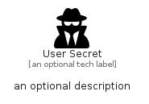

# UserSecret


```text
fontawesome/Solid/UserSecret
```

```text
include('fontawesome/Solid/UserSecret')
```


| Illustration | UserSecret |
| :---: | :---: |
|  |  |


## Sprites
The item provides the following sriptes:

- `<$UserSecretXs>`
- `<$UserSecretSm>`
- `<$UserSecretMd>`
- `<$UserSecretLg>`


## UserSecret

### Load remotely
```plantuml
@startuml
' configures the library
!global $LIB_BASE_LOCATION="https://raw.githubusercontent.com/tmorin/plantuml-libs/master/distribution"

' loads the library's bootstrap
!include $LIB_BASE_LOCATION/bootstrap.puml

' loads the package bootstrap
include('fontawesome/bootstrap')

' loads the Item which embeds the element UserSecret
include('fontawesome/Solid/UserSecret')

' renders the element
UserSecret('UserSecret', 'User Secret', 'an optional tech label', 'an optional description')
@enduml
```

### Load locally
```plantuml
@startuml
' configures the library
!global $INCLUSION_MODE="local"
!global $LIB_BASE_LOCATION="../.."

' loads the library's bootstrap
!include $LIB_BASE_LOCATION/bootstrap.puml

' loads the package bootstrap
include('fontawesome/bootstrap')

' loads the Item which embeds the element UserSecret
include('fontawesome/Solid/UserSecret')

' renders the element
UserSecret('UserSecret', 'User Secret', 'an optional tech label', 'an optional description')
@enduml
```

