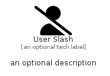

# UserSlash


```text
fontawesome/Solid/UserSlash
```

```text
include('fontawesome/Solid/UserSlash')
```


| Illustration | UserSlash |
| :---: | :---: |
|  |  |


## Sprites
The item provides the following sriptes:

- `<$UserSlashXs>`
- `<$UserSlashSm>`
- `<$UserSlashMd>`
- `<$UserSlashLg>`


## UserSlash

### Load remotely
```plantuml
@startuml
' configures the library
!global $LIB_BASE_LOCATION="https://raw.githubusercontent.com/tmorin/plantuml-libs/master/distribution"

' loads the library's bootstrap
!include $LIB_BASE_LOCATION/bootstrap.puml

' loads the package bootstrap
include('fontawesome/bootstrap')

' loads the Item which embeds the element UserSlash
include('fontawesome/Solid/UserSlash')

' renders the element
UserSlash('UserSlash', 'User Slash', 'an optional tech label', 'an optional description')
@enduml
```

### Load locally
```plantuml
@startuml
' configures the library
!global $INCLUSION_MODE="local"
!global $LIB_BASE_LOCATION="../.."

' loads the library's bootstrap
!include $LIB_BASE_LOCATION/bootstrap.puml

' loads the package bootstrap
include('fontawesome/bootstrap')

' loads the Item which embeds the element UserSlash
include('fontawesome/Solid/UserSlash')

' renders the element
UserSlash('UserSlash', 'User Slash', 'an optional tech label', 'an optional description')
@enduml
```

