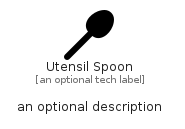

# UtensilSpoon


```text
fontawesome/Solid/UtensilSpoon
```

```text
include('fontawesome/Solid/UtensilSpoon')
```


| Illustration | UtensilSpoon |
| :---: | :---: |
|  |  |


## Sprites
The item provides the following sriptes:

- `<$UtensilSpoonXs>`
- `<$UtensilSpoonSm>`
- `<$UtensilSpoonMd>`
- `<$UtensilSpoonLg>`


## UtensilSpoon

### Load remotely
```plantuml
@startuml
' configures the library
!global $LIB_BASE_LOCATION="https://raw.githubusercontent.com/tmorin/plantuml-libs/master/distribution"

' loads the library's bootstrap
!include $LIB_BASE_LOCATION/bootstrap.puml

' loads the package bootstrap
include('fontawesome/bootstrap')

' loads the Item which embeds the element UtensilSpoon
include('fontawesome/Solid/UtensilSpoon')

' renders the element
UtensilSpoon('UtensilSpoon', 'Utensil Spoon', 'an optional tech label', 'an optional description')
@enduml
```

### Load locally
```plantuml
@startuml
' configures the library
!global $INCLUSION_MODE="local"
!global $LIB_BASE_LOCATION="../.."

' loads the library's bootstrap
!include $LIB_BASE_LOCATION/bootstrap.puml

' loads the package bootstrap
include('fontawesome/bootstrap')

' loads the Item which embeds the element UtensilSpoon
include('fontawesome/Solid/UtensilSpoon')

' renders the element
UtensilSpoon('UtensilSpoon', 'Utensil Spoon', 'an optional tech label', 'an optional description')
@enduml
```

