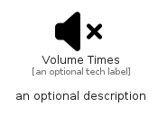

# VolumeTimes


```text
fontawesome/Solid/VolumeTimes
```

```text
include('fontawesome/Solid/VolumeTimes')
```


| Illustration | VolumeTimes |
| :---: | :---: |
|  |  |


## Sprites
The item provides the following sriptes:

- `<$VolumeTimesXs>`
- `<$VolumeTimesSm>`
- `<$VolumeTimesMd>`
- `<$VolumeTimesLg>`


## VolumeTimes

### Load remotely
```plantuml
@startuml
' configures the library
!global $LIB_BASE_LOCATION="https://raw.githubusercontent.com/tmorin/plantuml-libs/master/distribution"

' loads the library's bootstrap
!include $LIB_BASE_LOCATION/bootstrap.puml

' loads the package bootstrap
include('fontawesome/bootstrap')

' loads the Item which embeds the element VolumeTimes
include('fontawesome/Solid/VolumeTimes')

' renders the element
VolumeTimes('VolumeTimes', 'Volume Times', 'an optional tech label', 'an optional description')
@enduml
```

### Load locally
```plantuml
@startuml
' configures the library
!global $INCLUSION_MODE="local"
!global $LIB_BASE_LOCATION="../.."

' loads the library's bootstrap
!include $LIB_BASE_LOCATION/bootstrap.puml

' loads the package bootstrap
include('fontawesome/bootstrap')

' loads the Item which embeds the element VolumeTimes
include('fontawesome/Solid/VolumeTimes')

' renders the element
VolumeTimes('VolumeTimes', 'Volume Times', 'an optional tech label', 'an optional description')
@enduml
```

