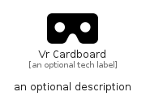

# VrCardboard


```text
fontawesome/Solid/VrCardboard
```

```text
include('fontawesome/Solid/VrCardboard')
```


| Illustration | VrCardboard |
| :---: | :---: |
|  |  |


## Sprites
The item provides the following sriptes:

- `<$VrCardboardXs>`
- `<$VrCardboardSm>`
- `<$VrCardboardMd>`
- `<$VrCardboardLg>`


## VrCardboard

### Load remotely
```plantuml
@startuml
' configures the library
!global $LIB_BASE_LOCATION="https://raw.githubusercontent.com/tmorin/plantuml-libs/master/distribution"

' loads the library's bootstrap
!include $LIB_BASE_LOCATION/bootstrap.puml

' loads the package bootstrap
include('fontawesome/bootstrap')

' loads the Item which embeds the element VrCardboard
include('fontawesome/Solid/VrCardboard')

' renders the element
VrCardboard('VrCardboard', 'Vr Cardboard', 'an optional tech label', 'an optional description')
@enduml
```

### Load locally
```plantuml
@startuml
' configures the library
!global $INCLUSION_MODE="local"
!global $LIB_BASE_LOCATION="../.."

' loads the library's bootstrap
!include $LIB_BASE_LOCATION/bootstrap.puml

' loads the package bootstrap
include('fontawesome/bootstrap')

' loads the Item which embeds the element VrCardboard
include('fontawesome/Solid/VrCardboard')

' renders the element
VrCardboard('VrCardboard', 'Vr Cardboard', 'an optional tech label', 'an optional description')
@enduml
```

