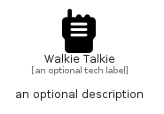

# WalkieTalkie


```text
fontawesome/Solid/WalkieTalkie
```

```text
include('fontawesome/Solid/WalkieTalkie')
```


| Illustration | WalkieTalkie |
| :---: | :---: |
|  |  |


## Sprites
The item provides the following sriptes:

- `<$WalkieTalkieXs>`
- `<$WalkieTalkieSm>`
- `<$WalkieTalkieMd>`
- `<$WalkieTalkieLg>`


## WalkieTalkie

### Load remotely
```plantuml
@startuml
' configures the library
!global $LIB_BASE_LOCATION="https://raw.githubusercontent.com/tmorin/plantuml-libs/master/distribution"

' loads the library's bootstrap
!include $LIB_BASE_LOCATION/bootstrap.puml

' loads the package bootstrap
include('fontawesome/bootstrap')

' loads the Item which embeds the element WalkieTalkie
include('fontawesome/Solid/WalkieTalkie')

' renders the element
WalkieTalkie('WalkieTalkie', 'Walkie Talkie', 'an optional tech label', 'an optional description')
@enduml
```

### Load locally
```plantuml
@startuml
' configures the library
!global $INCLUSION_MODE="local"
!global $LIB_BASE_LOCATION="../.."

' loads the library's bootstrap
!include $LIB_BASE_LOCATION/bootstrap.puml

' loads the package bootstrap
include('fontawesome/bootstrap')

' loads the Item which embeds the element WalkieTalkie
include('fontawesome/Solid/WalkieTalkie')

' renders the element
WalkieTalkie('WalkieTalkie', 'Walkie Talkie', 'an optional tech label', 'an optional description')
@enduml
```

