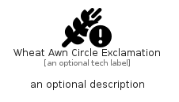

# WheatAwnCircleExclamation


```text
fontawesome/Solid/WheatAwnCircleExclamation
```

```text
include('fontawesome/Solid/WheatAwnCircleExclamation')
```


| Illustration | WheatAwnCircleExclamation |
| :---: | :---: |
|  |  |


## Sprites
The item provides the following sriptes:

- `<$WheatAwnCircleExclamationXs>`
- `<$WheatAwnCircleExclamationSm>`
- `<$WheatAwnCircleExclamationMd>`
- `<$WheatAwnCircleExclamationLg>`


## WheatAwnCircleExclamation

### Load remotely
```plantuml
@startuml
' configures the library
!global $LIB_BASE_LOCATION="https://raw.githubusercontent.com/tmorin/plantuml-libs/master/distribution"

' loads the library's bootstrap
!include $LIB_BASE_LOCATION/bootstrap.puml

' loads the package bootstrap
include('fontawesome/bootstrap')

' loads the Item which embeds the element WheatAwnCircleExclamation
include('fontawesome/Solid/WheatAwnCircleExclamation')

' renders the element
WheatAwnCircleExclamation('WheatAwnCircleExclamation', 'Wheat Awn Circle Exclamation', 'an optional tech label', 'an optional description')
@enduml
```

### Load locally
```plantuml
@startuml
' configures the library
!global $INCLUSION_MODE="local"
!global $LIB_BASE_LOCATION="../.."

' loads the library's bootstrap
!include $LIB_BASE_LOCATION/bootstrap.puml

' loads the package bootstrap
include('fontawesome/bootstrap')

' loads the Item which embeds the element WheatAwnCircleExclamation
include('fontawesome/Solid/WheatAwnCircleExclamation')

' renders the element
WheatAwnCircleExclamation('WheatAwnCircleExclamation', 'Wheat Awn Circle Exclamation', 'an optional tech label', 'an optional description')
@enduml
```

