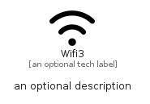

# Wifi3


```text
fontawesome/Solid/Wifi3
```

```text
include('fontawesome/Solid/Wifi3')
```


| Illustration | Wifi3 |
| :---: | :---: |
|  |  |


## Sprites
The item provides the following sriptes:

- `<$Wifi3Xs>`
- `<$Wifi3Sm>`
- `<$Wifi3Md>`
- `<$Wifi3Lg>`


## Wifi3

### Load remotely
```plantuml
@startuml
' configures the library
!global $LIB_BASE_LOCATION="https://raw.githubusercontent.com/tmorin/plantuml-libs/master/distribution"

' loads the library's bootstrap
!include $LIB_BASE_LOCATION/bootstrap.puml

' loads the package bootstrap
include('fontawesome/bootstrap')

' loads the Item which embeds the element Wifi3
include('fontawesome/Solid/Wifi3')

' renders the element
Wifi3('Wifi3', 'Wifi3', 'an optional tech label', 'an optional description')
@enduml
```

### Load locally
```plantuml
@startuml
' configures the library
!global $INCLUSION_MODE="local"
!global $LIB_BASE_LOCATION="../.."

' loads the library's bootstrap
!include $LIB_BASE_LOCATION/bootstrap.puml

' loads the package bootstrap
include('fontawesome/bootstrap')

' loads the Item which embeds the element Wifi3
include('fontawesome/Solid/Wifi3')

' renders the element
Wifi3('Wifi3', 'Wifi3', 'an optional tech label', 'an optional description')
@enduml
```

