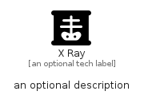

# XRay


```text
fontawesome/Solid/XRay
```

```text
include('fontawesome/Solid/XRay')
```


| Illustration | XRay |
| :---: | :---: |
|  |  |


## Sprites
The item provides the following sriptes:

- `<$XRayXs>`
- `<$XRaySm>`
- `<$XRayMd>`
- `<$XRayLg>`


## XRay

### Load remotely
```plantuml
@startuml
' configures the library
!global $LIB_BASE_LOCATION="https://raw.githubusercontent.com/tmorin/plantuml-libs/master/distribution"

' loads the library's bootstrap
!include $LIB_BASE_LOCATION/bootstrap.puml

' loads the package bootstrap
include('fontawesome/bootstrap')

' loads the Item which embeds the element XRay
include('fontawesome/Solid/XRay')

' renders the element
XRay('XRay', 'X Ray', 'an optional tech label', 'an optional description')
@enduml
```

### Load locally
```plantuml
@startuml
' configures the library
!global $INCLUSION_MODE="local"
!global $LIB_BASE_LOCATION="../.."

' loads the library's bootstrap
!include $LIB_BASE_LOCATION/bootstrap.puml

' loads the package bootstrap
include('fontawesome/bootstrap')

' loads the Item which embeds the element XRay
include('fontawesome/Solid/XRay')

' renders the element
XRay('XRay', 'X Ray', 'an optional tech label', 'an optional description')
@enduml
```

