# Group

The module contains 22 items.

| |Name|
|:---:|---|
| 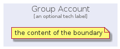 | [gcp/Group/GroupAccount](../../gcp/Group/GroupAccount.md) |
|  | [gcp/Group/GroupCloudServiceProvider](../../gcp/Group/GroupCloudServiceProvider.md) |
|  | [gcp/Group/GroupExternalDataSources](../../gcp/Group/GroupExternalDataSources.md) |
|  | [gcp/Group/GroupExternalInfrastructure1stParty](../../gcp/Group/GroupExternalInfrastructure1stParty.md) |
| 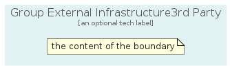 | [gcp/Group/GroupExternalInfrastructure3rdParty](../../gcp/Group/GroupExternalInfrastructure3rdParty.md) |
| 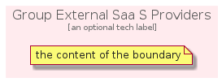 | [gcp/Group/GroupExternalSaaSProviders](../../gcp/Group/GroupExternalSaaSProviders.md) |
| 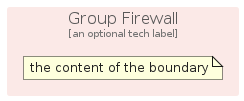 | [gcp/Group/GroupFirewall](../../gcp/Group/GroupFirewall.md) |
| 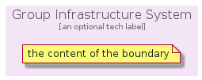 | [gcp/Group/GroupInfrastructureSystem](../../gcp/Group/GroupInfrastructureSystem.md) |
| 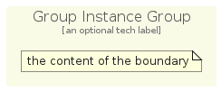 | [gcp/Group/GroupInstanceGroup](../../gcp/Group/GroupInstanceGroup.md) |
| 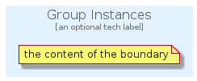 | [gcp/Group/GroupInstances](../../gcp/Group/GroupInstances.md) |
|  | [gcp/Group/GroupKubernetesCluster](../../gcp/Group/GroupKubernetesCluster.md) |
| 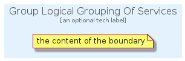 | [gcp/Group/GroupLogicalGroupingOfServices](../../gcp/Group/GroupLogicalGroupingOfServices.md) |
|  | [gcp/Group/GroupOnPremise](../../gcp/Group/GroupOnPremise.md) |
| 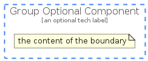 | [gcp/Group/GroupOptionalComponent](../../gcp/Group/GroupOptionalComponent.md) |
| 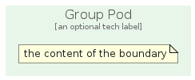 | [gcp/Group/GroupPod](../../gcp/Group/GroupPod.md) |
|  | [gcp/Group/GroupProjectZone](../../gcp/Group/GroupProjectZone.md) |
| 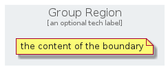 | [gcp/Group/GroupRegion](../../gcp/Group/GroupRegion.md) |
|  | [gcp/Group/GroupReplicaPool](../../gcp/Group/GroupReplicaPool.md) |
|  | [gcp/Group/GroupSubNetwork](../../gcp/Group/GroupSubNetwork.md) |
| 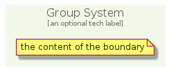 | [gcp/Group/GroupSystem](../../gcp/Group/GroupSystem.md) |
|  | [gcp/Group/GroupUser](../../gcp/Group/GroupUser.md) |
|  | [gcp/Group/GroupZone](../../gcp/Group/GroupZone.md) |

