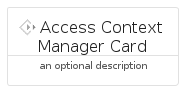
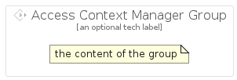

# AccessContextManager


```text
gcp/Item/AccessContextManager
```

```text
include('gcp/Item/AccessContextManager')
```


| Illustration | AccessContextManager | AccessContextManagerCard | AccessContextManagerGroup |
| :---: | :---: | :---: | :---: |
|  |  |  |  |


## AccessContextManager

### Load remotely
```plantuml
@startuml
' configures the library
!global $LIB_BASE_LOCATION="https://raw.githubusercontent.com/tmorin/plantuml-libs/master/distribution"

' loads the library's bootstrap
!include $LIB_BASE_LOCATION/bootstrap.puml

' loads the package bootstrap
include('gcp/bootstrap')

' loads the Item which embeds the element AccessContextManager
include('gcp/Item/AccessContextManager')

' renders the element
AccessContextManager('AccessContextManager', 'Access Context Manager', 'an optional tech label', 'an optional description')
@enduml
```

### Load locally
```plantuml
@startuml
' configures the library
!global $INCLUSION_MODE="local"
!global $LIB_BASE_LOCATION="../.."

' loads the library's bootstrap
!include $LIB_BASE_LOCATION/bootstrap.puml

' loads the package bootstrap
include('gcp/bootstrap')

' loads the Item which embeds the element AccessContextManager
include('gcp/Item/AccessContextManager')

' renders the element
AccessContextManager('AccessContextManager', 'Access Context Manager', 'an optional tech label', 'an optional description')
@enduml
```

## AccessContextManagerCard

### Load remotely
```plantuml
@startuml
' configures the library
!global $LIB_BASE_LOCATION="https://raw.githubusercontent.com/tmorin/plantuml-libs/master/distribution"

' loads the library's bootstrap
!include $LIB_BASE_LOCATION/bootstrap.puml

' loads the package bootstrap
include('gcp/bootstrap')

' loads the Item which embeds the element AccessContextManagerCard
include('gcp/Item/AccessContextManager')

' renders the element
AccessContextManagerCard('AccessContextManagerCard', 'Access Context Manager Card', 'an optional description')
@enduml
```

### Load locally
```plantuml
@startuml
' configures the library
!global $INCLUSION_MODE="local"
!global $LIB_BASE_LOCATION="../.."

' loads the library's bootstrap
!include $LIB_BASE_LOCATION/bootstrap.puml

' loads the package bootstrap
include('gcp/bootstrap')

' loads the Item which embeds the element AccessContextManagerCard
include('gcp/Item/AccessContextManager')

' renders the element
AccessContextManagerCard('AccessContextManagerCard', 'Access Context Manager Card', 'an optional description')
@enduml
```

## AccessContextManagerGroup

### Load remotely
```plantuml
@startuml
' configures the library
!global $LIB_BASE_LOCATION="https://raw.githubusercontent.com/tmorin/plantuml-libs/master/distribution"

' loads the library's bootstrap
!include $LIB_BASE_LOCATION/bootstrap.puml

' loads the package bootstrap
include('gcp/bootstrap')

' loads the Item which embeds the element AccessContextManagerGroup
include('gcp/Item/AccessContextManager')

' renders the element
AccessContextManagerGroup('AccessContextManagerGroup', 'Access Context Manager Group', 'an optional tech label') {
    note as note
        the content of the group
    end note
}
@enduml
```

### Load locally
```plantuml
@startuml
' configures the library
!global $INCLUSION_MODE="local"
!global $LIB_BASE_LOCATION="../.."

' loads the library's bootstrap
!include $LIB_BASE_LOCATION/bootstrap.puml

' loads the package bootstrap
include('gcp/bootstrap')

' loads the Item which embeds the element AccessContextManagerGroup
include('gcp/Item/AccessContextManager')

' renders the element
AccessContextManagerGroup('AccessContextManagerGroup', 'Access Context Manager Group', 'an optional tech label') {
    note as note
        the content of the group
    end note
}
@enduml
```

