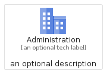
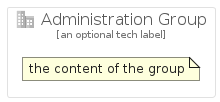

# Administration


```text
gcp/Item/Administration
```

```text
include('gcp/Item/Administration')
```


| Illustration | Administration | AdministrationCard | AdministrationGroup |
| :---: | :---: | :---: | :---: |
|  |  |  |  |


## Administration

### Load remotely
```plantuml
@startuml
' configures the library
!global $LIB_BASE_LOCATION="https://raw.githubusercontent.com/tmorin/plantuml-libs/master/distribution"

' loads the library's bootstrap
!include $LIB_BASE_LOCATION/bootstrap.puml

' loads the package bootstrap
include('gcp/bootstrap')

' loads the Item which embeds the element Administration
include('gcp/Item/Administration')

' renders the element
Administration('Administration', 'Administration', 'an optional tech label')
@enduml
```

### Load locally
```plantuml
@startuml
' configures the library
!global $INCLUSION_MODE="local"
!global $LIB_BASE_LOCATION="../.."

' loads the library's bootstrap
!include $LIB_BASE_LOCATION/bootstrap.puml

' loads the package bootstrap
include('gcp/bootstrap')

' loads the Item which embeds the element Administration
include('gcp/Item/Administration')

' renders the element
Administration('Administration', 'Administration', 'an optional tech label')
@enduml
```

## AdministrationCard

### Load remotely
```plantuml
@startuml
' configures the library
!global $LIB_BASE_LOCATION="https://raw.githubusercontent.com/tmorin/plantuml-libs/master/distribution"

' loads the library's bootstrap
!include $LIB_BASE_LOCATION/bootstrap.puml

' loads the package bootstrap
include('gcp/bootstrap')

' loads the Item which embeds the element AdministrationCard
include('gcp/Item/Administration')

' renders the element
AdministrationCard('AdministrationCard', 'Administration Card', 'an optional description')
@enduml
```

### Load locally
```plantuml
@startuml
' configures the library
!global $INCLUSION_MODE="local"
!global $LIB_BASE_LOCATION="../.."

' loads the library's bootstrap
!include $LIB_BASE_LOCATION/bootstrap.puml

' loads the package bootstrap
include('gcp/bootstrap')

' loads the Item which embeds the element AdministrationCard
include('gcp/Item/Administration')

' renders the element
AdministrationCard('AdministrationCard', 'Administration Card', 'an optional description')
@enduml
```

## AdministrationGroup

### Load remotely
```plantuml
@startuml
' configures the library
!global $LIB_BASE_LOCATION="https://raw.githubusercontent.com/tmorin/plantuml-libs/master/distribution"

' loads the library's bootstrap
!include $LIB_BASE_LOCATION/bootstrap.puml

' loads the package bootstrap
include('gcp/bootstrap')

' loads the Item which embeds the element AdministrationGroup
include('gcp/Item/Administration')

' renders the element
AdministrationGroup('AdministrationGroup', 'Administration Group', 'an optional tech label') {
    note as note
        the content of the group
    end note
}
@enduml
```

### Load locally
```plantuml
@startuml
' configures the library
!global $INCLUSION_MODE="local"
!global $LIB_BASE_LOCATION="../.."

' loads the library's bootstrap
!include $LIB_BASE_LOCATION/bootstrap.puml

' loads the package bootstrap
include('gcp/bootstrap')

' loads the Item which embeds the element AdministrationGroup
include('gcp/Item/Administration')

' renders the element
AdministrationGroup('AdministrationGroup', 'Administration Group', 'an optional tech label') {
    note as note
        the content of the group
    end note
}
@enduml
```

