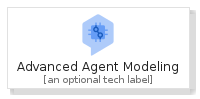
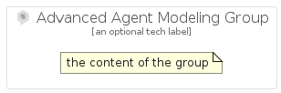

# AdvancedAgentModeling


```text
gcp/Item/AdvancedAgentModeling
```

```text
include('gcp/Item/AdvancedAgentModeling')
```


| Illustration | AdvancedAgentModeling | AdvancedAgentModelingCard | AdvancedAgentModelingGroup |
| :---: | :---: | :---: | :---: |
|  |  |  |  |


## AdvancedAgentModeling

### Load remotely
```plantuml
@startuml
' configures the library
!global $LIB_BASE_LOCATION="https://raw.githubusercontent.com/tmorin/plantuml-libs/master/distribution"

' loads the library's bootstrap
!include $LIB_BASE_LOCATION/bootstrap.puml

' loads the package bootstrap
include('gcp/bootstrap')

' loads the Item which embeds the element AdvancedAgentModeling
include('gcp/Item/AdvancedAgentModeling')

' renders the element
AdvancedAgentModeling('AdvancedAgentModeling', 'Advanced Agent Modeling', 'an optional tech label')
@enduml
```

### Load locally
```plantuml
@startuml
' configures the library
!global $INCLUSION_MODE="local"
!global $LIB_BASE_LOCATION="../.."

' loads the library's bootstrap
!include $LIB_BASE_LOCATION/bootstrap.puml

' loads the package bootstrap
include('gcp/bootstrap')

' loads the Item which embeds the element AdvancedAgentModeling
include('gcp/Item/AdvancedAgentModeling')

' renders the element
AdvancedAgentModeling('AdvancedAgentModeling', 'Advanced Agent Modeling', 'an optional tech label')
@enduml
```

## AdvancedAgentModelingCard

### Load remotely
```plantuml
@startuml
' configures the library
!global $LIB_BASE_LOCATION="https://raw.githubusercontent.com/tmorin/plantuml-libs/master/distribution"

' loads the library's bootstrap
!include $LIB_BASE_LOCATION/bootstrap.puml

' loads the package bootstrap
include('gcp/bootstrap')

' loads the Item which embeds the element AdvancedAgentModelingCard
include('gcp/Item/AdvancedAgentModeling')

' renders the element
AdvancedAgentModelingCard('AdvancedAgentModelingCard', 'Advanced Agent Modeling Card', 'an optional description')
@enduml
```

### Load locally
```plantuml
@startuml
' configures the library
!global $INCLUSION_MODE="local"
!global $LIB_BASE_LOCATION="../.."

' loads the library's bootstrap
!include $LIB_BASE_LOCATION/bootstrap.puml

' loads the package bootstrap
include('gcp/bootstrap')

' loads the Item which embeds the element AdvancedAgentModelingCard
include('gcp/Item/AdvancedAgentModeling')

' renders the element
AdvancedAgentModelingCard('AdvancedAgentModelingCard', 'Advanced Agent Modeling Card', 'an optional description')
@enduml
```

## AdvancedAgentModelingGroup

### Load remotely
```plantuml
@startuml
' configures the library
!global $LIB_BASE_LOCATION="https://raw.githubusercontent.com/tmorin/plantuml-libs/master/distribution"

' loads the library's bootstrap
!include $LIB_BASE_LOCATION/bootstrap.puml

' loads the package bootstrap
include('gcp/bootstrap')

' loads the Item which embeds the element AdvancedAgentModelingGroup
include('gcp/Item/AdvancedAgentModeling')

' renders the element
AdvancedAgentModelingGroup('AdvancedAgentModelingGroup', 'Advanced Agent Modeling Group', 'an optional tech label') {
    note as note
        the content of the group
    end note
}
@enduml
```

### Load locally
```plantuml
@startuml
' configures the library
!global $INCLUSION_MODE="local"
!global $LIB_BASE_LOCATION="../.."

' loads the library's bootstrap
!include $LIB_BASE_LOCATION/bootstrap.puml

' loads the package bootstrap
include('gcp/bootstrap')

' loads the Item which embeds the element AdvancedAgentModelingGroup
include('gcp/Item/AdvancedAgentModeling')

' renders the element
AdvancedAgentModelingGroup('AdvancedAgentModelingGroup', 'Advanced Agent Modeling Group', 'an optional tech label') {
    note as note
        the content of the group
    end note
}
@enduml
```

