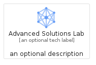
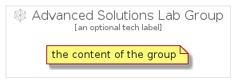

# AdvancedSolutionsLab


```text
gcp/Item/AdvancedSolutionsLab
```

```text
include('gcp/Item/AdvancedSolutionsLab')
```


| Illustration | AdvancedSolutionsLab | AdvancedSolutionsLabCard | AdvancedSolutionsLabGroup |
| :---: | :---: | :---: | :---: |
|  |  |  |  |


## AdvancedSolutionsLab

### Load remotely
```plantuml
@startuml
' configures the library
!global $LIB_BASE_LOCATION="https://raw.githubusercontent.com/tmorin/plantuml-libs/master/distribution"

' loads the library's bootstrap
!include $LIB_BASE_LOCATION/bootstrap.puml

' loads the package bootstrap
include('gcp/bootstrap')

' loads the Item which embeds the element AdvancedSolutionsLab
include('gcp/Item/AdvancedSolutionsLab')

' renders the element
AdvancedSolutionsLab('AdvancedSolutionsLab', 'Advanced Solutions Lab', 'an optional tech label')
@enduml
```

### Load locally
```plantuml
@startuml
' configures the library
!global $INCLUSION_MODE="local"
!global $LIB_BASE_LOCATION="../.."

' loads the library's bootstrap
!include $LIB_BASE_LOCATION/bootstrap.puml

' loads the package bootstrap
include('gcp/bootstrap')

' loads the Item which embeds the element AdvancedSolutionsLab
include('gcp/Item/AdvancedSolutionsLab')

' renders the element
AdvancedSolutionsLab('AdvancedSolutionsLab', 'Advanced Solutions Lab', 'an optional tech label')
@enduml
```

## AdvancedSolutionsLabCard

### Load remotely
```plantuml
@startuml
' configures the library
!global $LIB_BASE_LOCATION="https://raw.githubusercontent.com/tmorin/plantuml-libs/master/distribution"

' loads the library's bootstrap
!include $LIB_BASE_LOCATION/bootstrap.puml

' loads the package bootstrap
include('gcp/bootstrap')

' loads the Item which embeds the element AdvancedSolutionsLabCard
include('gcp/Item/AdvancedSolutionsLab')

' renders the element
AdvancedSolutionsLabCard('AdvancedSolutionsLabCard', 'Advanced Solutions Lab Card', 'an optional description')
@enduml
```

### Load locally
```plantuml
@startuml
' configures the library
!global $INCLUSION_MODE="local"
!global $LIB_BASE_LOCATION="../.."

' loads the library's bootstrap
!include $LIB_BASE_LOCATION/bootstrap.puml

' loads the package bootstrap
include('gcp/bootstrap')

' loads the Item which embeds the element AdvancedSolutionsLabCard
include('gcp/Item/AdvancedSolutionsLab')

' renders the element
AdvancedSolutionsLabCard('AdvancedSolutionsLabCard', 'Advanced Solutions Lab Card', 'an optional description')
@enduml
```

## AdvancedSolutionsLabGroup

### Load remotely
```plantuml
@startuml
' configures the library
!global $LIB_BASE_LOCATION="https://raw.githubusercontent.com/tmorin/plantuml-libs/master/distribution"

' loads the library's bootstrap
!include $LIB_BASE_LOCATION/bootstrap.puml

' loads the package bootstrap
include('gcp/bootstrap')

' loads the Item which embeds the element AdvancedSolutionsLabGroup
include('gcp/Item/AdvancedSolutionsLab')

' renders the element
AdvancedSolutionsLabGroup('AdvancedSolutionsLabGroup', 'Advanced Solutions Lab Group', 'an optional tech label') {
    note as note
        the content of the group
    end note
}
@enduml
```

### Load locally
```plantuml
@startuml
' configures the library
!global $INCLUSION_MODE="local"
!global $LIB_BASE_LOCATION="../.."

' loads the library's bootstrap
!include $LIB_BASE_LOCATION/bootstrap.puml

' loads the package bootstrap
include('gcp/bootstrap')

' loads the Item which embeds the element AdvancedSolutionsLabGroup
include('gcp/Item/AdvancedSolutionsLab')

' renders the element
AdvancedSolutionsLabGroup('AdvancedSolutionsLabGroup', 'Advanced Solutions Lab Group', 'an optional tech label') {
    note as note
        the content of the group
    end note
}
@enduml
```

