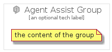

# AgentAssist


```text
gcp/Item/AgentAssist
```

```text
include('gcp/Item/AgentAssist')
```


| Illustration | AgentAssist | AgentAssistCard | AgentAssistGroup |
| :---: | :---: | :---: | :---: |
|  |  |  |  |


## AgentAssist

### Load remotely
```plantuml
@startuml
' configures the library
!global $LIB_BASE_LOCATION="https://raw.githubusercontent.com/tmorin/plantuml-libs/master/distribution"

' loads the library's bootstrap
!include $LIB_BASE_LOCATION/bootstrap.puml

' loads the package bootstrap
include('gcp/bootstrap')

' loads the Item which embeds the element AgentAssist
include('gcp/Item/AgentAssist')

' renders the element
AgentAssist('AgentAssist', 'Agent Assist', 'an optional tech label', 'an optional description')
@enduml
```

### Load locally
```plantuml
@startuml
' configures the library
!global $INCLUSION_MODE="local"
!global $LIB_BASE_LOCATION="../.."

' loads the library's bootstrap
!include $LIB_BASE_LOCATION/bootstrap.puml

' loads the package bootstrap
include('gcp/bootstrap')

' loads the Item which embeds the element AgentAssist
include('gcp/Item/AgentAssist')

' renders the element
AgentAssist('AgentAssist', 'Agent Assist', 'an optional tech label', 'an optional description')
@enduml
```

## AgentAssistCard

### Load remotely
```plantuml
@startuml
' configures the library
!global $LIB_BASE_LOCATION="https://raw.githubusercontent.com/tmorin/plantuml-libs/master/distribution"

' loads the library's bootstrap
!include $LIB_BASE_LOCATION/bootstrap.puml

' loads the package bootstrap
include('gcp/bootstrap')

' loads the Item which embeds the element AgentAssistCard
include('gcp/Item/AgentAssist')

' renders the element
AgentAssistCard('AgentAssistCard', 'Agent Assist Card', 'an optional description')
@enduml
```

### Load locally
```plantuml
@startuml
' configures the library
!global $INCLUSION_MODE="local"
!global $LIB_BASE_LOCATION="../.."

' loads the library's bootstrap
!include $LIB_BASE_LOCATION/bootstrap.puml

' loads the package bootstrap
include('gcp/bootstrap')

' loads the Item which embeds the element AgentAssistCard
include('gcp/Item/AgentAssist')

' renders the element
AgentAssistCard('AgentAssistCard', 'Agent Assist Card', 'an optional description')
@enduml
```

## AgentAssistGroup

### Load remotely
```plantuml
@startuml
' configures the library
!global $LIB_BASE_LOCATION="https://raw.githubusercontent.com/tmorin/plantuml-libs/master/distribution"

' loads the library's bootstrap
!include $LIB_BASE_LOCATION/bootstrap.puml

' loads the package bootstrap
include('gcp/bootstrap')

' loads the Item which embeds the element AgentAssistGroup
include('gcp/Item/AgentAssist')

' renders the element
AgentAssistGroup('AgentAssistGroup', 'Agent Assist Group', 'an optional tech label') {
    note as note
        the content of the group
    end note
}
@enduml
```

### Load locally
```plantuml
@startuml
' configures the library
!global $INCLUSION_MODE="local"
!global $LIB_BASE_LOCATION="../.."

' loads the library's bootstrap
!include $LIB_BASE_LOCATION/bootstrap.puml

' loads the package bootstrap
include('gcp/bootstrap')

' loads the Item which embeds the element AgentAssistGroup
include('gcp/Item/AgentAssist')

' renders the element
AgentAssistGroup('AgentAssistGroup', 'Agent Assist Group', 'an optional tech label') {
    note as note
        the content of the group
    end note
}
@enduml
```

