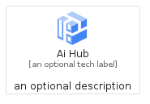
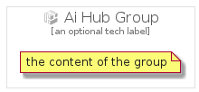

# AiHub


```text
gcp/Item/AiHub
```

```text
include('gcp/Item/AiHub')
```


| Illustration | AiHub | AiHubCard | AiHubGroup |
| :---: | :---: | :---: | :---: |
|  |  |  |  |


## AiHub

### Load remotely
```plantuml
@startuml
' configures the library
!global $LIB_BASE_LOCATION="https://raw.githubusercontent.com/tmorin/plantuml-libs/master/distribution"

' loads the library's bootstrap
!include $LIB_BASE_LOCATION/bootstrap.puml

' loads the package bootstrap
include('gcp/bootstrap')

' loads the Item which embeds the element AiHub
include('gcp/Item/AiHub')

' renders the element
AiHub('AiHub', 'Ai Hub', 'an optional tech label')
@enduml
```

### Load locally
```plantuml
@startuml
' configures the library
!global $INCLUSION_MODE="local"
!global $LIB_BASE_LOCATION="../.."

' loads the library's bootstrap
!include $LIB_BASE_LOCATION/bootstrap.puml

' loads the package bootstrap
include('gcp/bootstrap')

' loads the Item which embeds the element AiHub
include('gcp/Item/AiHub')

' renders the element
AiHub('AiHub', 'Ai Hub', 'an optional tech label')
@enduml
```

## AiHubCard

### Load remotely
```plantuml
@startuml
' configures the library
!global $LIB_BASE_LOCATION="https://raw.githubusercontent.com/tmorin/plantuml-libs/master/distribution"

' loads the library's bootstrap
!include $LIB_BASE_LOCATION/bootstrap.puml

' loads the package bootstrap
include('gcp/bootstrap')

' loads the Item which embeds the element AiHubCard
include('gcp/Item/AiHub')

' renders the element
AiHubCard('AiHubCard', 'Ai Hub Card', 'an optional description')
@enduml
```

### Load locally
```plantuml
@startuml
' configures the library
!global $INCLUSION_MODE="local"
!global $LIB_BASE_LOCATION="../.."

' loads the library's bootstrap
!include $LIB_BASE_LOCATION/bootstrap.puml

' loads the package bootstrap
include('gcp/bootstrap')

' loads the Item which embeds the element AiHubCard
include('gcp/Item/AiHub')

' renders the element
AiHubCard('AiHubCard', 'Ai Hub Card', 'an optional description')
@enduml
```

## AiHubGroup

### Load remotely
```plantuml
@startuml
' configures the library
!global $LIB_BASE_LOCATION="https://raw.githubusercontent.com/tmorin/plantuml-libs/master/distribution"

' loads the library's bootstrap
!include $LIB_BASE_LOCATION/bootstrap.puml

' loads the package bootstrap
include('gcp/bootstrap')

' loads the Item which embeds the element AiHubGroup
include('gcp/Item/AiHub')

' renders the element
AiHubGroup('AiHubGroup', 'Ai Hub Group', 'an optional tech label') {
    note as note
        the content of the group
    end note
}
@enduml
```

### Load locally
```plantuml
@startuml
' configures the library
!global $INCLUSION_MODE="local"
!global $LIB_BASE_LOCATION="../.."

' loads the library's bootstrap
!include $LIB_BASE_LOCATION/bootstrap.puml

' loads the package bootstrap
include('gcp/bootstrap')

' loads the Item which embeds the element AiHubGroup
include('gcp/Item/AiHub')

' renders the element
AiHubGroup('AiHubGroup', 'Ai Hub Group', 'an optional tech label') {
    note as note
        the content of the group
    end note
}
@enduml
```

