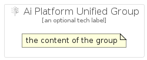

# AiPlatformUnified


```text
gcp/Item/AiPlatformUnified
```

```text
include('gcp/Item/AiPlatformUnified')
```


| Illustration | AiPlatformUnified | AiPlatformUnifiedCard | AiPlatformUnifiedGroup |
| :---: | :---: | :---: | :---: |
|  |  |  |  |


## AiPlatformUnified

### Load remotely
```plantuml
@startuml
' configures the library
!global $LIB_BASE_LOCATION="https://raw.githubusercontent.com/tmorin/plantuml-libs/master/distribution"

' loads the library's bootstrap
!include $LIB_BASE_LOCATION/bootstrap.puml

' loads the package bootstrap
include('gcp/bootstrap')

' loads the Item which embeds the element AiPlatformUnified
include('gcp/Item/AiPlatformUnified')

' renders the element
AiPlatformUnified('AiPlatformUnified', 'Ai Platform Unified', 'an optional tech label')
@enduml
```

### Load locally
```plantuml
@startuml
' configures the library
!global $INCLUSION_MODE="local"
!global $LIB_BASE_LOCATION="../.."

' loads the library's bootstrap
!include $LIB_BASE_LOCATION/bootstrap.puml

' loads the package bootstrap
include('gcp/bootstrap')

' loads the Item which embeds the element AiPlatformUnified
include('gcp/Item/AiPlatformUnified')

' renders the element
AiPlatformUnified('AiPlatformUnified', 'Ai Platform Unified', 'an optional tech label')
@enduml
```

## AiPlatformUnifiedCard

### Load remotely
```plantuml
@startuml
' configures the library
!global $LIB_BASE_LOCATION="https://raw.githubusercontent.com/tmorin/plantuml-libs/master/distribution"

' loads the library's bootstrap
!include $LIB_BASE_LOCATION/bootstrap.puml

' loads the package bootstrap
include('gcp/bootstrap')

' loads the Item which embeds the element AiPlatformUnifiedCard
include('gcp/Item/AiPlatformUnified')

' renders the element
AiPlatformUnifiedCard('AiPlatformUnifiedCard', 'Ai Platform Unified Card', 'an optional description')
@enduml
```

### Load locally
```plantuml
@startuml
' configures the library
!global $INCLUSION_MODE="local"
!global $LIB_BASE_LOCATION="../.."

' loads the library's bootstrap
!include $LIB_BASE_LOCATION/bootstrap.puml

' loads the package bootstrap
include('gcp/bootstrap')

' loads the Item which embeds the element AiPlatformUnifiedCard
include('gcp/Item/AiPlatformUnified')

' renders the element
AiPlatformUnifiedCard('AiPlatformUnifiedCard', 'Ai Platform Unified Card', 'an optional description')
@enduml
```

## AiPlatformUnifiedGroup

### Load remotely
```plantuml
@startuml
' configures the library
!global $LIB_BASE_LOCATION="https://raw.githubusercontent.com/tmorin/plantuml-libs/master/distribution"

' loads the library's bootstrap
!include $LIB_BASE_LOCATION/bootstrap.puml

' loads the package bootstrap
include('gcp/bootstrap')

' loads the Item which embeds the element AiPlatformUnifiedGroup
include('gcp/Item/AiPlatformUnified')

' renders the element
AiPlatformUnifiedGroup('AiPlatformUnifiedGroup', 'Ai Platform Unified Group', 'an optional tech label') {
    note as note
        the content of the group
    end note
}
@enduml
```

### Load locally
```plantuml
@startuml
' configures the library
!global $INCLUSION_MODE="local"
!global $LIB_BASE_LOCATION="../.."

' loads the library's bootstrap
!include $LIB_BASE_LOCATION/bootstrap.puml

' loads the package bootstrap
include('gcp/bootstrap')

' loads the Item which embeds the element AiPlatformUnifiedGroup
include('gcp/Item/AiPlatformUnified')

' renders the element
AiPlatformUnifiedGroup('AiPlatformUnifiedGroup', 'Ai Platform Unified Group', 'an optional tech label') {
    note as note
        the content of the group
    end note
}
@enduml
```

