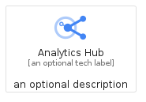
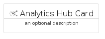
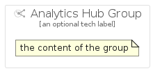

# AnalyticsHub


```text
gcp/Item/AnalyticsHub
```

```text
include('gcp/Item/AnalyticsHub')
```


| Illustration | AnalyticsHub | AnalyticsHubCard | AnalyticsHubGroup |
| :---: | :---: | :---: | :---: |
|  |  |  |  |


## AnalyticsHub

### Load remotely
```plantuml
@startuml
' configures the library
!global $LIB_BASE_LOCATION="https://raw.githubusercontent.com/tmorin/plantuml-libs/master/distribution"

' loads the library's bootstrap
!include $LIB_BASE_LOCATION/bootstrap.puml

' loads the package bootstrap
include('gcp/bootstrap')

' loads the Item which embeds the element AnalyticsHub
include('gcp/Item/AnalyticsHub')

' renders the element
AnalyticsHub('AnalyticsHub', 'Analytics Hub', 'an optional tech label')
@enduml
```

### Load locally
```plantuml
@startuml
' configures the library
!global $INCLUSION_MODE="local"
!global $LIB_BASE_LOCATION="../.."

' loads the library's bootstrap
!include $LIB_BASE_LOCATION/bootstrap.puml

' loads the package bootstrap
include('gcp/bootstrap')

' loads the Item which embeds the element AnalyticsHub
include('gcp/Item/AnalyticsHub')

' renders the element
AnalyticsHub('AnalyticsHub', 'Analytics Hub', 'an optional tech label')
@enduml
```

## AnalyticsHubCard

### Load remotely
```plantuml
@startuml
' configures the library
!global $LIB_BASE_LOCATION="https://raw.githubusercontent.com/tmorin/plantuml-libs/master/distribution"

' loads the library's bootstrap
!include $LIB_BASE_LOCATION/bootstrap.puml

' loads the package bootstrap
include('gcp/bootstrap')

' loads the Item which embeds the element AnalyticsHubCard
include('gcp/Item/AnalyticsHub')

' renders the element
AnalyticsHubCard('AnalyticsHubCard', 'Analytics Hub Card', 'an optional description')
@enduml
```

### Load locally
```plantuml
@startuml
' configures the library
!global $INCLUSION_MODE="local"
!global $LIB_BASE_LOCATION="../.."

' loads the library's bootstrap
!include $LIB_BASE_LOCATION/bootstrap.puml

' loads the package bootstrap
include('gcp/bootstrap')

' loads the Item which embeds the element AnalyticsHubCard
include('gcp/Item/AnalyticsHub')

' renders the element
AnalyticsHubCard('AnalyticsHubCard', 'Analytics Hub Card', 'an optional description')
@enduml
```

## AnalyticsHubGroup

### Load remotely
```plantuml
@startuml
' configures the library
!global $LIB_BASE_LOCATION="https://raw.githubusercontent.com/tmorin/plantuml-libs/master/distribution"

' loads the library's bootstrap
!include $LIB_BASE_LOCATION/bootstrap.puml

' loads the package bootstrap
include('gcp/bootstrap')

' loads the Item which embeds the element AnalyticsHubGroup
include('gcp/Item/AnalyticsHub')

' renders the element
AnalyticsHubGroup('AnalyticsHubGroup', 'Analytics Hub Group', 'an optional tech label') {
    note as note
        the content of the group
    end note
}
@enduml
```

### Load locally
```plantuml
@startuml
' configures the library
!global $INCLUSION_MODE="local"
!global $LIB_BASE_LOCATION="../.."

' loads the library's bootstrap
!include $LIB_BASE_LOCATION/bootstrap.puml

' loads the package bootstrap
include('gcp/bootstrap')

' loads the Item which embeds the element AnalyticsHubGroup
include('gcp/Item/AnalyticsHub')

' renders the element
AnalyticsHubGroup('AnalyticsHubGroup', 'Analytics Hub Group', 'an optional tech label') {
    note as note
        the content of the group
    end note
}
@enduml
```

