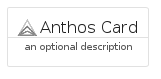

# Anthos


```text
gcp/Item/Anthos
```

```text
include('gcp/Item/Anthos')
```


| Illustration | Anthos | AnthosCard | AnthosGroup |
| :---: | :---: | :---: | :---: |
|  |  |  |  |


## Anthos

### Load remotely
```plantuml
@startuml
' configures the library
!global $LIB_BASE_LOCATION="https://raw.githubusercontent.com/tmorin/plantuml-libs/master/distribution"

' loads the library's bootstrap
!include $LIB_BASE_LOCATION/bootstrap.puml

' loads the package bootstrap
include('gcp/bootstrap')

' loads the Item which embeds the element Anthos
include('gcp/Item/Anthos')

' renders the element
Anthos('Anthos', 'Anthos', 'an optional tech label', 'an optional description')
@enduml
```

### Load locally
```plantuml
@startuml
' configures the library
!global $INCLUSION_MODE="local"
!global $LIB_BASE_LOCATION="../.."

' loads the library's bootstrap
!include $LIB_BASE_LOCATION/bootstrap.puml

' loads the package bootstrap
include('gcp/bootstrap')

' loads the Item which embeds the element Anthos
include('gcp/Item/Anthos')

' renders the element
Anthos('Anthos', 'Anthos', 'an optional tech label', 'an optional description')
@enduml
```

## AnthosCard

### Load remotely
```plantuml
@startuml
' configures the library
!global $LIB_BASE_LOCATION="https://raw.githubusercontent.com/tmorin/plantuml-libs/master/distribution"

' loads the library's bootstrap
!include $LIB_BASE_LOCATION/bootstrap.puml

' loads the package bootstrap
include('gcp/bootstrap')

' loads the Item which embeds the element AnthosCard
include('gcp/Item/Anthos')

' renders the element
AnthosCard('AnthosCard', 'Anthos Card', 'an optional description')
@enduml
```

### Load locally
```plantuml
@startuml
' configures the library
!global $INCLUSION_MODE="local"
!global $LIB_BASE_LOCATION="../.."

' loads the library's bootstrap
!include $LIB_BASE_LOCATION/bootstrap.puml

' loads the package bootstrap
include('gcp/bootstrap')

' loads the Item which embeds the element AnthosCard
include('gcp/Item/Anthos')

' renders the element
AnthosCard('AnthosCard', 'Anthos Card', 'an optional description')
@enduml
```

## AnthosGroup

### Load remotely
```plantuml
@startuml
' configures the library
!global $LIB_BASE_LOCATION="https://raw.githubusercontent.com/tmorin/plantuml-libs/master/distribution"

' loads the library's bootstrap
!include $LIB_BASE_LOCATION/bootstrap.puml

' loads the package bootstrap
include('gcp/bootstrap')

' loads the Item which embeds the element AnthosGroup
include('gcp/Item/Anthos')

' renders the element
AnthosGroup('AnthosGroup', 'Anthos Group', 'an optional tech label') {
    note as note
        the content of the group
    end note
}
@enduml
```

### Load locally
```plantuml
@startuml
' configures the library
!global $INCLUSION_MODE="local"
!global $LIB_BASE_LOCATION="../.."

' loads the library's bootstrap
!include $LIB_BASE_LOCATION/bootstrap.puml

' loads the package bootstrap
include('gcp/bootstrap')

' loads the Item which embeds the element AnthosGroup
include('gcp/Item/Anthos')

' renders the element
AnthosGroup('AnthosGroup', 'Anthos Group', 'an optional tech label') {
    note as note
        the content of the group
    end note
}
@enduml
```

