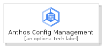
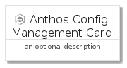
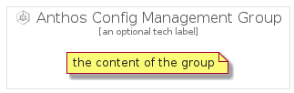

# AnthosConfigManagement


```text
gcp/Item/AnthosConfigManagement
```

```text
include('gcp/Item/AnthosConfigManagement')
```


| Illustration | AnthosConfigManagement | AnthosConfigManagementCard | AnthosConfigManagementGroup |
| :---: | :---: | :---: | :---: |
|  |  |  |  |


## AnthosConfigManagement

### Load remotely
```plantuml
@startuml
' configures the library
!global $LIB_BASE_LOCATION="https://raw.githubusercontent.com/tmorin/plantuml-libs/master/distribution"

' loads the library's bootstrap
!include $LIB_BASE_LOCATION/bootstrap.puml

' loads the package bootstrap
include('gcp/bootstrap')

' loads the Item which embeds the element AnthosConfigManagement
include('gcp/Item/AnthosConfigManagement')

' renders the element
AnthosConfigManagement('AnthosConfigManagement', 'Anthos Config Management', 'an optional tech label', 'an optional description')
@enduml
```

### Load locally
```plantuml
@startuml
' configures the library
!global $INCLUSION_MODE="local"
!global $LIB_BASE_LOCATION="../.."

' loads the library's bootstrap
!include $LIB_BASE_LOCATION/bootstrap.puml

' loads the package bootstrap
include('gcp/bootstrap')

' loads the Item which embeds the element AnthosConfigManagement
include('gcp/Item/AnthosConfigManagement')

' renders the element
AnthosConfigManagement('AnthosConfigManagement', 'Anthos Config Management', 'an optional tech label', 'an optional description')
@enduml
```

## AnthosConfigManagementCard

### Load remotely
```plantuml
@startuml
' configures the library
!global $LIB_BASE_LOCATION="https://raw.githubusercontent.com/tmorin/plantuml-libs/master/distribution"

' loads the library's bootstrap
!include $LIB_BASE_LOCATION/bootstrap.puml

' loads the package bootstrap
include('gcp/bootstrap')

' loads the Item which embeds the element AnthosConfigManagementCard
include('gcp/Item/AnthosConfigManagement')

' renders the element
AnthosConfigManagementCard('AnthosConfigManagementCard', 'Anthos Config Management Card', 'an optional description')
@enduml
```

### Load locally
```plantuml
@startuml
' configures the library
!global $INCLUSION_MODE="local"
!global $LIB_BASE_LOCATION="../.."

' loads the library's bootstrap
!include $LIB_BASE_LOCATION/bootstrap.puml

' loads the package bootstrap
include('gcp/bootstrap')

' loads the Item which embeds the element AnthosConfigManagementCard
include('gcp/Item/AnthosConfigManagement')

' renders the element
AnthosConfigManagementCard('AnthosConfigManagementCard', 'Anthos Config Management Card', 'an optional description')
@enduml
```

## AnthosConfigManagementGroup

### Load remotely
```plantuml
@startuml
' configures the library
!global $LIB_BASE_LOCATION="https://raw.githubusercontent.com/tmorin/plantuml-libs/master/distribution"

' loads the library's bootstrap
!include $LIB_BASE_LOCATION/bootstrap.puml

' loads the package bootstrap
include('gcp/bootstrap')

' loads the Item which embeds the element AnthosConfigManagementGroup
include('gcp/Item/AnthosConfigManagement')

' renders the element
AnthosConfigManagementGroup('AnthosConfigManagementGroup', 'Anthos Config Management Group', 'an optional tech label') {
    note as note
        the content of the group
    end note
}
@enduml
```

### Load locally
```plantuml
@startuml
' configures the library
!global $INCLUSION_MODE="local"
!global $LIB_BASE_LOCATION="../.."

' loads the library's bootstrap
!include $LIB_BASE_LOCATION/bootstrap.puml

' loads the package bootstrap
include('gcp/bootstrap')

' loads the Item which embeds the element AnthosConfigManagementGroup
include('gcp/Item/AnthosConfigManagement')

' renders the element
AnthosConfigManagementGroup('AnthosConfigManagementGroup', 'Anthos Config Management Group', 'an optional tech label') {
    note as note
        the content of the group
    end note
}
@enduml
```

