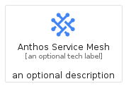
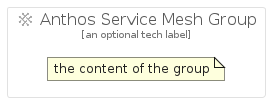

# AnthosServiceMesh


```text
gcp/Item/AnthosServiceMesh
```

```text
include('gcp/Item/AnthosServiceMesh')
```


| Illustration | AnthosServiceMesh | AnthosServiceMeshCard | AnthosServiceMeshGroup |
| :---: | :---: | :---: | :---: |
|  |  |  |  |


## AnthosServiceMesh

### Load remotely
```plantuml
@startuml
' configures the library
!global $LIB_BASE_LOCATION="https://raw.githubusercontent.com/tmorin/plantuml-libs/master/distribution"

' loads the library's bootstrap
!include $LIB_BASE_LOCATION/bootstrap.puml

' loads the package bootstrap
include('gcp/bootstrap')

' loads the Item which embeds the element AnthosServiceMesh
include('gcp/Item/AnthosServiceMesh')

' renders the element
AnthosServiceMesh('AnthosServiceMesh', 'Anthos Service Mesh', 'an optional tech label')
@enduml
```

### Load locally
```plantuml
@startuml
' configures the library
!global $INCLUSION_MODE="local"
!global $LIB_BASE_LOCATION="../.."

' loads the library's bootstrap
!include $LIB_BASE_LOCATION/bootstrap.puml

' loads the package bootstrap
include('gcp/bootstrap')

' loads the Item which embeds the element AnthosServiceMesh
include('gcp/Item/AnthosServiceMesh')

' renders the element
AnthosServiceMesh('AnthosServiceMesh', 'Anthos Service Mesh', 'an optional tech label')
@enduml
```

## AnthosServiceMeshCard

### Load remotely
```plantuml
@startuml
' configures the library
!global $LIB_BASE_LOCATION="https://raw.githubusercontent.com/tmorin/plantuml-libs/master/distribution"

' loads the library's bootstrap
!include $LIB_BASE_LOCATION/bootstrap.puml

' loads the package bootstrap
include('gcp/bootstrap')

' loads the Item which embeds the element AnthosServiceMeshCard
include('gcp/Item/AnthosServiceMesh')

' renders the element
AnthosServiceMeshCard('AnthosServiceMeshCard', 'Anthos Service Mesh Card', 'an optional description')
@enduml
```

### Load locally
```plantuml
@startuml
' configures the library
!global $INCLUSION_MODE="local"
!global $LIB_BASE_LOCATION="../.."

' loads the library's bootstrap
!include $LIB_BASE_LOCATION/bootstrap.puml

' loads the package bootstrap
include('gcp/bootstrap')

' loads the Item which embeds the element AnthosServiceMeshCard
include('gcp/Item/AnthosServiceMesh')

' renders the element
AnthosServiceMeshCard('AnthosServiceMeshCard', 'Anthos Service Mesh Card', 'an optional description')
@enduml
```

## AnthosServiceMeshGroup

### Load remotely
```plantuml
@startuml
' configures the library
!global $LIB_BASE_LOCATION="https://raw.githubusercontent.com/tmorin/plantuml-libs/master/distribution"

' loads the library's bootstrap
!include $LIB_BASE_LOCATION/bootstrap.puml

' loads the package bootstrap
include('gcp/bootstrap')

' loads the Item which embeds the element AnthosServiceMeshGroup
include('gcp/Item/AnthosServiceMesh')

' renders the element
AnthosServiceMeshGroup('AnthosServiceMeshGroup', 'Anthos Service Mesh Group', 'an optional tech label') {
    note as note
        the content of the group
    end note
}
@enduml
```

### Load locally
```plantuml
@startuml
' configures the library
!global $INCLUSION_MODE="local"
!global $LIB_BASE_LOCATION="../.."

' loads the library's bootstrap
!include $LIB_BASE_LOCATION/bootstrap.puml

' loads the package bootstrap
include('gcp/bootstrap')

' loads the Item which embeds the element AnthosServiceMeshGroup
include('gcp/Item/AnthosServiceMesh')

' renders the element
AnthosServiceMeshGroup('AnthosServiceMeshGroup', 'Anthos Service Mesh Group', 'an optional tech label') {
    note as note
        the content of the group
    end note
}
@enduml
```

