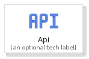
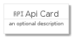
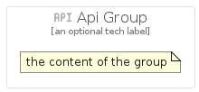

# Api


```text
gcp/Item/Api
```

```text
include('gcp/Item/Api')
```


| Illustration | Api | ApiCard | ApiGroup |
| :---: | :---: | :---: | :---: |
|  |  |  |  |


## Api

### Load remotely
```plantuml
@startuml
' configures the library
!global $LIB_BASE_LOCATION="https://raw.githubusercontent.com/tmorin/plantuml-libs/master/distribution"

' loads the library's bootstrap
!include $LIB_BASE_LOCATION/bootstrap.puml

' loads the package bootstrap
include('gcp/bootstrap')

' loads the Item which embeds the element Api
include('gcp/Item/Api')

' renders the element
Api('Api', 'Api', 'an optional tech label')
@enduml
```

### Load locally
```plantuml
@startuml
' configures the library
!global $INCLUSION_MODE="local"
!global $LIB_BASE_LOCATION="../.."

' loads the library's bootstrap
!include $LIB_BASE_LOCATION/bootstrap.puml

' loads the package bootstrap
include('gcp/bootstrap')

' loads the Item which embeds the element Api
include('gcp/Item/Api')

' renders the element
Api('Api', 'Api', 'an optional tech label')
@enduml
```

## ApiCard

### Load remotely
```plantuml
@startuml
' configures the library
!global $LIB_BASE_LOCATION="https://raw.githubusercontent.com/tmorin/plantuml-libs/master/distribution"

' loads the library's bootstrap
!include $LIB_BASE_LOCATION/bootstrap.puml

' loads the package bootstrap
include('gcp/bootstrap')

' loads the Item which embeds the element ApiCard
include('gcp/Item/Api')

' renders the element
ApiCard('ApiCard', 'Api Card', 'an optional description')
@enduml
```

### Load locally
```plantuml
@startuml
' configures the library
!global $INCLUSION_MODE="local"
!global $LIB_BASE_LOCATION="../.."

' loads the library's bootstrap
!include $LIB_BASE_LOCATION/bootstrap.puml

' loads the package bootstrap
include('gcp/bootstrap')

' loads the Item which embeds the element ApiCard
include('gcp/Item/Api')

' renders the element
ApiCard('ApiCard', 'Api Card', 'an optional description')
@enduml
```

## ApiGroup

### Load remotely
```plantuml
@startuml
' configures the library
!global $LIB_BASE_LOCATION="https://raw.githubusercontent.com/tmorin/plantuml-libs/master/distribution"

' loads the library's bootstrap
!include $LIB_BASE_LOCATION/bootstrap.puml

' loads the package bootstrap
include('gcp/bootstrap')

' loads the Item which embeds the element ApiGroup
include('gcp/Item/Api')

' renders the element
ApiGroup('ApiGroup', 'Api Group', 'an optional tech label') {
    note as note
        the content of the group
    end note
}
@enduml
```

### Load locally
```plantuml
@startuml
' configures the library
!global $INCLUSION_MODE="local"
!global $LIB_BASE_LOCATION="../.."

' loads the library's bootstrap
!include $LIB_BASE_LOCATION/bootstrap.puml

' loads the package bootstrap
include('gcp/bootstrap')

' loads the Item which embeds the element ApiGroup
include('gcp/Item/Api')

' renders the element
ApiGroup('ApiGroup', 'Api Group', 'an optional tech label') {
    note as note
        the content of the group
    end note
}
@enduml
```

