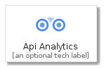
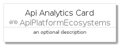
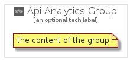

# ApiAnalytics


```text
gcp/Item/ApiPlatformEcosystems/ApiAnalytics
```

```text
include('gcp/Item/ApiPlatformEcosystems/ApiAnalytics')
```


| Illustration | ApiAnalytics | ApiAnalyticsCard | ApiAnalyticsGroup |
| :---: | :---: | :---: | :---: |
|  |  |  |  |


## ApiAnalytics

### Load remotely
```plantuml
@startuml
' configures the library
!global $LIB_BASE_LOCATION="https://raw.githubusercontent.com/tmorin/plantuml-libs/master/distribution"

' loads the library's bootstrap
!include $LIB_BASE_LOCATION/bootstrap.puml

' loads the package bootstrap
include('gcp/bootstrap')

' loads the Item which embeds the element ApiAnalytics
include('gcp/Item/ApiPlatformEcosystems/ApiAnalytics')

' renders the element
ApiAnalytics('ApiAnalytics', 'Api Analytics', 'an optional tech label')
@enduml
```

### Load locally
```plantuml
@startuml
' configures the library
!global $INCLUSION_MODE="local"
!global $LIB_BASE_LOCATION="../../.."

' loads the library's bootstrap
!include $LIB_BASE_LOCATION/bootstrap.puml

' loads the package bootstrap
include('gcp/bootstrap')

' loads the Item which embeds the element ApiAnalytics
include('gcp/Item/ApiPlatformEcosystems/ApiAnalytics')

' renders the element
ApiAnalytics('ApiAnalytics', 'Api Analytics', 'an optional tech label')
@enduml
```

## ApiAnalyticsCard

### Load remotely
```plantuml
@startuml
' configures the library
!global $LIB_BASE_LOCATION="https://raw.githubusercontent.com/tmorin/plantuml-libs/master/distribution"

' loads the library's bootstrap
!include $LIB_BASE_LOCATION/bootstrap.puml

' loads the package bootstrap
include('gcp/bootstrap')

' loads the Item which embeds the element ApiAnalyticsCard
include('gcp/Item/ApiPlatformEcosystems/ApiAnalytics')

' renders the element
ApiAnalyticsCard('ApiAnalyticsCard', 'Api Analytics Card', 'an optional description')
@enduml
```

### Load locally
```plantuml
@startuml
' configures the library
!global $INCLUSION_MODE="local"
!global $LIB_BASE_LOCATION="../../.."

' loads the library's bootstrap
!include $LIB_BASE_LOCATION/bootstrap.puml

' loads the package bootstrap
include('gcp/bootstrap')

' loads the Item which embeds the element ApiAnalyticsCard
include('gcp/Item/ApiPlatformEcosystems/ApiAnalytics')

' renders the element
ApiAnalyticsCard('ApiAnalyticsCard', 'Api Analytics Card', 'an optional description')
@enduml
```

## ApiAnalyticsGroup

### Load remotely
```plantuml
@startuml
' configures the library
!global $LIB_BASE_LOCATION="https://raw.githubusercontent.com/tmorin/plantuml-libs/master/distribution"

' loads the library's bootstrap
!include $LIB_BASE_LOCATION/bootstrap.puml

' loads the package bootstrap
include('gcp/bootstrap')

' loads the Item which embeds the element ApiAnalyticsGroup
include('gcp/Item/ApiPlatformEcosystems/ApiAnalytics')

' renders the element
ApiAnalyticsGroup('ApiAnalyticsGroup', 'Api Analytics Group', 'an optional tech label') {
    note as note
        the content of the group
    end note
}
@enduml
```

### Load locally
```plantuml
@startuml
' configures the library
!global $INCLUSION_MODE="local"
!global $LIB_BASE_LOCATION="../../.."

' loads the library's bootstrap
!include $LIB_BASE_LOCATION/bootstrap.puml

' loads the package bootstrap
include('gcp/bootstrap')

' loads the Item which embeds the element ApiAnalyticsGroup
include('gcp/Item/ApiPlatformEcosystems/ApiAnalytics')

' renders the element
ApiAnalyticsGroup('ApiAnalyticsGroup', 'Api Analytics Group', 'an optional tech label') {
    note as note
        the content of the group
    end note
}
@enduml
```

