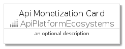
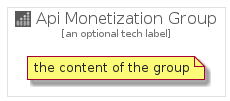

# ApiMonetization


```text
gcp/Item/ApiPlatformEcosystems/ApiMonetization
```

```text
include('gcp/Item/ApiPlatformEcosystems/ApiMonetization')
```


| Illustration | ApiMonetization | ApiMonetizationCard | ApiMonetizationGroup |
| :---: | :---: | :---: | :---: |
|  |  |  |  |


## ApiMonetization

### Load remotely
```plantuml
@startuml
' configures the library
!global $LIB_BASE_LOCATION="https://github.com/tmorin/plantuml-libs/distribution"

' loads the library's bootstrap
!include $LIB_BASE_LOCATION/bootstrap.puml

' loads the package bootstrap
include('gcp/bootstrap')

' loads the Item which embeds the element ApiMonetization
include('gcp/Item/ApiPlatformEcosystems/ApiMonetization')

' renders the element
ApiMonetization('ApiMonetization', 'Api Monetization', 'an optional tech label')
@enduml
```

### Load locally
```plantuml
@startuml
' configures the library
!global $INCLUSION_MODE="local"
!global $LIB_BASE_LOCATION="../../.."

' loads the library's bootstrap
!include $LIB_BASE_LOCATION/bootstrap.puml

' loads the package bootstrap
include('gcp/bootstrap')

' loads the Item which embeds the element ApiMonetization
include('gcp/Item/ApiPlatformEcosystems/ApiMonetization')

' renders the element
ApiMonetization('ApiMonetization', 'Api Monetization', 'an optional tech label')
@enduml
```

## ApiMonetizationCard

### Load remotely
```plantuml
@startuml
' configures the library
!global $LIB_BASE_LOCATION="https://github.com/tmorin/plantuml-libs/distribution"

' loads the library's bootstrap
!include $LIB_BASE_LOCATION/bootstrap.puml

' loads the package bootstrap
include('gcp/bootstrap')

' loads the Item which embeds the element ApiMonetizationCard
include('gcp/Item/ApiPlatformEcosystems/ApiMonetization')

' renders the element
ApiMonetizationCard('ApiMonetizationCard', 'Api Monetization Card', 'an optional description')
@enduml
```

### Load locally
```plantuml
@startuml
' configures the library
!global $INCLUSION_MODE="local"
!global $LIB_BASE_LOCATION="../../.."

' loads the library's bootstrap
!include $LIB_BASE_LOCATION/bootstrap.puml

' loads the package bootstrap
include('gcp/bootstrap')

' loads the Item which embeds the element ApiMonetizationCard
include('gcp/Item/ApiPlatformEcosystems/ApiMonetization')

' renders the element
ApiMonetizationCard('ApiMonetizationCard', 'Api Monetization Card', 'an optional description')
@enduml
```

## ApiMonetizationGroup

### Load remotely
```plantuml
@startuml
' configures the library
!global $LIB_BASE_LOCATION="https://github.com/tmorin/plantuml-libs/distribution"

' loads the library's bootstrap
!include $LIB_BASE_LOCATION/bootstrap.puml

' loads the package bootstrap
include('gcp/bootstrap')

' loads the Item which embeds the element ApiMonetizationGroup
include('gcp/Item/ApiPlatformEcosystems/ApiMonetization')

' renders the element
ApiMonetizationGroup('ApiMonetizationGroup', 'Api Monetization Group', 'an optional tech label') {
    note as note
        the content of the group
    end note
}
@enduml
```

### Load locally
```plantuml
@startuml
' configures the library
!global $INCLUSION_MODE="local"
!global $LIB_BASE_LOCATION="../../.."

' loads the library's bootstrap
!include $LIB_BASE_LOCATION/bootstrap.puml

' loads the package bootstrap
include('gcp/bootstrap')

' loads the Item which embeds the element ApiMonetizationGroup
include('gcp/Item/ApiPlatformEcosystems/ApiMonetization')

' renders the element
ApiMonetizationGroup('ApiMonetizationGroup', 'Api Monetization Group', 'an optional tech label') {
    note as note
        the content of the group
    end note
}
@enduml
```

