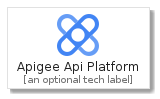
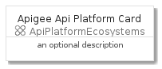
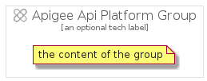

# ApigeeApiPlatform


```text
gcp/Item/ApiPlatformEcosystems/ApigeeApiPlatform
```

```text
include('gcp/Item/ApiPlatformEcosystems/ApigeeApiPlatform')
```


| Illustration | ApigeeApiPlatform | ApigeeApiPlatformCard | ApigeeApiPlatformGroup |
| :---: | :---: | :---: | :---: |
|  |  |  |  |


## ApigeeApiPlatform

### Load remotely
```plantuml
@startuml
' configures the library
!global $LIB_BASE_LOCATION="https://raw.githubusercontent.com/tmorin/plantuml-libs/master/distribution"

' loads the library's bootstrap
!include $LIB_BASE_LOCATION/bootstrap.puml

' loads the package bootstrap
include('gcp/bootstrap')

' loads the Item which embeds the element ApigeeApiPlatform
include('gcp/Item/ApiPlatformEcosystems/ApigeeApiPlatform')

' renders the element
ApigeeApiPlatform('ApigeeApiPlatform', 'Apigee Api Platform', 'an optional tech label')
@enduml
```

### Load locally
```plantuml
@startuml
' configures the library
!global $INCLUSION_MODE="local"
!global $LIB_BASE_LOCATION="../../.."

' loads the library's bootstrap
!include $LIB_BASE_LOCATION/bootstrap.puml

' loads the package bootstrap
include('gcp/bootstrap')

' loads the Item which embeds the element ApigeeApiPlatform
include('gcp/Item/ApiPlatformEcosystems/ApigeeApiPlatform')

' renders the element
ApigeeApiPlatform('ApigeeApiPlatform', 'Apigee Api Platform', 'an optional tech label')
@enduml
```

## ApigeeApiPlatformCard

### Load remotely
```plantuml
@startuml
' configures the library
!global $LIB_BASE_LOCATION="https://raw.githubusercontent.com/tmorin/plantuml-libs/master/distribution"

' loads the library's bootstrap
!include $LIB_BASE_LOCATION/bootstrap.puml

' loads the package bootstrap
include('gcp/bootstrap')

' loads the Item which embeds the element ApigeeApiPlatformCard
include('gcp/Item/ApiPlatformEcosystems/ApigeeApiPlatform')

' renders the element
ApigeeApiPlatformCard('ApigeeApiPlatformCard', 'Apigee Api Platform Card', 'an optional description')
@enduml
```

### Load locally
```plantuml
@startuml
' configures the library
!global $INCLUSION_MODE="local"
!global $LIB_BASE_LOCATION="../../.."

' loads the library's bootstrap
!include $LIB_BASE_LOCATION/bootstrap.puml

' loads the package bootstrap
include('gcp/bootstrap')

' loads the Item which embeds the element ApigeeApiPlatformCard
include('gcp/Item/ApiPlatformEcosystems/ApigeeApiPlatform')

' renders the element
ApigeeApiPlatformCard('ApigeeApiPlatformCard', 'Apigee Api Platform Card', 'an optional description')
@enduml
```

## ApigeeApiPlatformGroup

### Load remotely
```plantuml
@startuml
' configures the library
!global $LIB_BASE_LOCATION="https://raw.githubusercontent.com/tmorin/plantuml-libs/master/distribution"

' loads the library's bootstrap
!include $LIB_BASE_LOCATION/bootstrap.puml

' loads the package bootstrap
include('gcp/bootstrap')

' loads the Item which embeds the element ApigeeApiPlatformGroup
include('gcp/Item/ApiPlatformEcosystems/ApigeeApiPlatform')

' renders the element
ApigeeApiPlatformGroup('ApigeeApiPlatformGroup', 'Apigee Api Platform Group', 'an optional tech label') {
    note as note
        the content of the group
    end note
}
@enduml
```

### Load locally
```plantuml
@startuml
' configures the library
!global $INCLUSION_MODE="local"
!global $LIB_BASE_LOCATION="../../.."

' loads the library's bootstrap
!include $LIB_BASE_LOCATION/bootstrap.puml

' loads the package bootstrap
include('gcp/bootstrap')

' loads the Item which embeds the element ApigeeApiPlatformGroup
include('gcp/Item/ApiPlatformEcosystems/ApigeeApiPlatform')

' renders the element
ApigeeApiPlatformGroup('ApigeeApiPlatformGroup', 'Apigee Api Platform Group', 'an optional tech label') {
    note as note
        the content of the group
    end note
}
@enduml
```

