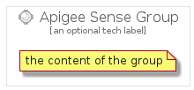

# ApigeeSense


```text
gcp/Item/ApiPlatformEcosystems/ApigeeSense
```

```text
include('gcp/Item/ApiPlatformEcosystems/ApigeeSense')
```


| Illustration | ApigeeSense | ApigeeSenseCard | ApigeeSenseGroup |
| :---: | :---: | :---: | :---: |
|  |  |  |  |


## ApigeeSense

### Load remotely
```plantuml
@startuml
' configures the library
!global $LIB_BASE_LOCATION="https://github.com/tmorin/plantuml-libs/distribution"

' loads the library's bootstrap
!include $LIB_BASE_LOCATION/bootstrap.puml

' loads the package bootstrap
include('gcp/bootstrap')

' loads the Item which embeds the element ApigeeSense
include('gcp/Item/ApiPlatformEcosystems/ApigeeSense')

' renders the element
ApigeeSense('ApigeeSense', 'Apigee Sense', 'an optional tech label')
@enduml
```

### Load locally
```plantuml
@startuml
' configures the library
!global $INCLUSION_MODE="local"
!global $LIB_BASE_LOCATION="../../.."

' loads the library's bootstrap
!include $LIB_BASE_LOCATION/bootstrap.puml

' loads the package bootstrap
include('gcp/bootstrap')

' loads the Item which embeds the element ApigeeSense
include('gcp/Item/ApiPlatformEcosystems/ApigeeSense')

' renders the element
ApigeeSense('ApigeeSense', 'Apigee Sense', 'an optional tech label')
@enduml
```

## ApigeeSenseCard

### Load remotely
```plantuml
@startuml
' configures the library
!global $LIB_BASE_LOCATION="https://github.com/tmorin/plantuml-libs/distribution"

' loads the library's bootstrap
!include $LIB_BASE_LOCATION/bootstrap.puml

' loads the package bootstrap
include('gcp/bootstrap')

' loads the Item which embeds the element ApigeeSenseCard
include('gcp/Item/ApiPlatformEcosystems/ApigeeSense')

' renders the element
ApigeeSenseCard('ApigeeSenseCard', 'Apigee Sense Card', 'an optional description')
@enduml
```

### Load locally
```plantuml
@startuml
' configures the library
!global $INCLUSION_MODE="local"
!global $LIB_BASE_LOCATION="../../.."

' loads the library's bootstrap
!include $LIB_BASE_LOCATION/bootstrap.puml

' loads the package bootstrap
include('gcp/bootstrap')

' loads the Item which embeds the element ApigeeSenseCard
include('gcp/Item/ApiPlatformEcosystems/ApigeeSense')

' renders the element
ApigeeSenseCard('ApigeeSenseCard', 'Apigee Sense Card', 'an optional description')
@enduml
```

## ApigeeSenseGroup

### Load remotely
```plantuml
@startuml
' configures the library
!global $LIB_BASE_LOCATION="https://github.com/tmorin/plantuml-libs/distribution"

' loads the library's bootstrap
!include $LIB_BASE_LOCATION/bootstrap.puml

' loads the package bootstrap
include('gcp/bootstrap')

' loads the Item which embeds the element ApigeeSenseGroup
include('gcp/Item/ApiPlatformEcosystems/ApigeeSense')

' renders the element
ApigeeSenseGroup('ApigeeSenseGroup', 'Apigee Sense Group', 'an optional tech label') {
    note as note
        the content of the group
    end note
}
@enduml
```

### Load locally
```plantuml
@startuml
' configures the library
!global $INCLUSION_MODE="local"
!global $LIB_BASE_LOCATION="../../.."

' loads the library's bootstrap
!include $LIB_BASE_LOCATION/bootstrap.puml

' loads the package bootstrap
include('gcp/bootstrap')

' loads the Item which embeds the element ApigeeSenseGroup
include('gcp/Item/ApiPlatformEcosystems/ApigeeSense')

' renders the element
ApigeeSenseGroup('ApigeeSenseGroup', 'Apigee Sense Group', 'an optional tech label') {
    note as note
        the content of the group
    end note
}
@enduml
```

