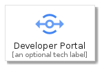
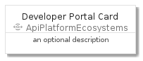
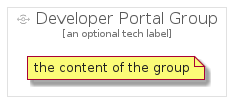

# DeveloperPortal


```text
gcp/Item/ApiPlatformEcosystems/DeveloperPortal
```

```text
include('gcp/Item/ApiPlatformEcosystems/DeveloperPortal')
```


| Illustration | DeveloperPortal | DeveloperPortalCard | DeveloperPortalGroup |
| :---: | :---: | :---: | :---: |
|  |  |  |  |


## DeveloperPortal

### Load remotely
```plantuml
@startuml
' configures the library
!global $LIB_BASE_LOCATION="https://github.com/tmorin/plantuml-libs/distribution"

' loads the library's bootstrap
!include $LIB_BASE_LOCATION/bootstrap.puml

' loads the package bootstrap
include('gcp/bootstrap')

' loads the Item which embeds the element DeveloperPortal
include('gcp/Item/ApiPlatformEcosystems/DeveloperPortal')

' renders the element
DeveloperPortal('DeveloperPortal', 'Developer Portal', 'an optional tech label')
@enduml
```

### Load locally
```plantuml
@startuml
' configures the library
!global $INCLUSION_MODE="local"
!global $LIB_BASE_LOCATION="../../.."

' loads the library's bootstrap
!include $LIB_BASE_LOCATION/bootstrap.puml

' loads the package bootstrap
include('gcp/bootstrap')

' loads the Item which embeds the element DeveloperPortal
include('gcp/Item/ApiPlatformEcosystems/DeveloperPortal')

' renders the element
DeveloperPortal('DeveloperPortal', 'Developer Portal', 'an optional tech label')
@enduml
```

## DeveloperPortalCard

### Load remotely
```plantuml
@startuml
' configures the library
!global $LIB_BASE_LOCATION="https://github.com/tmorin/plantuml-libs/distribution"

' loads the library's bootstrap
!include $LIB_BASE_LOCATION/bootstrap.puml

' loads the package bootstrap
include('gcp/bootstrap')

' loads the Item which embeds the element DeveloperPortalCard
include('gcp/Item/ApiPlatformEcosystems/DeveloperPortal')

' renders the element
DeveloperPortalCard('DeveloperPortalCard', 'Developer Portal Card', 'an optional description')
@enduml
```

### Load locally
```plantuml
@startuml
' configures the library
!global $INCLUSION_MODE="local"
!global $LIB_BASE_LOCATION="../../.."

' loads the library's bootstrap
!include $LIB_BASE_LOCATION/bootstrap.puml

' loads the package bootstrap
include('gcp/bootstrap')

' loads the Item which embeds the element DeveloperPortalCard
include('gcp/Item/ApiPlatformEcosystems/DeveloperPortal')

' renders the element
DeveloperPortalCard('DeveloperPortalCard', 'Developer Portal Card', 'an optional description')
@enduml
```

## DeveloperPortalGroup

### Load remotely
```plantuml
@startuml
' configures the library
!global $LIB_BASE_LOCATION="https://github.com/tmorin/plantuml-libs/distribution"

' loads the library's bootstrap
!include $LIB_BASE_LOCATION/bootstrap.puml

' loads the package bootstrap
include('gcp/bootstrap')

' loads the Item which embeds the element DeveloperPortalGroup
include('gcp/Item/ApiPlatformEcosystems/DeveloperPortal')

' renders the element
DeveloperPortalGroup('DeveloperPortalGroup', 'Developer Portal Group', 'an optional tech label') {
    note as note
        the content of the group
    end note
}
@enduml
```

### Load locally
```plantuml
@startuml
' configures the library
!global $INCLUSION_MODE="local"
!global $LIB_BASE_LOCATION="../../.."

' loads the library's bootstrap
!include $LIB_BASE_LOCATION/bootstrap.puml

' loads the package bootstrap
include('gcp/bootstrap')

' loads the Item which embeds the element DeveloperPortalGroup
include('gcp/Item/ApiPlatformEcosystems/DeveloperPortal')

' renders the element
DeveloperPortalGroup('DeveloperPortalGroup', 'Developer Portal Group', 'an optional tech label') {
    note as note
        the content of the group
    end note
}
@enduml
```

