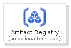
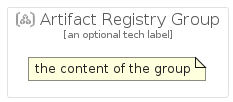

# ArtifactRegistry


```text
gcp/Item/ArtifactRegistry
```

```text
include('gcp/Item/ArtifactRegistry')
```


| Illustration | ArtifactRegistry | ArtifactRegistryCard | ArtifactRegistryGroup |
| :---: | :---: | :---: | :---: |
|  |  |  |  |


## Sprites
The item provides the following sriptes:

- `<$ArtifactRegistryXs>`
- `<$ArtifactRegistrySm>`
- `<$ArtifactRegistryMd>`
- `<$ArtifactRegistryLg>`


## ArtifactRegistry

### Load remotely
```plantuml
@startuml
' configures the library
!global $LIB_BASE_LOCATION="https://raw.githubusercontent.com/tmorin/plantuml-libs/master/distribution"

' loads the library's bootstrap
!include $LIB_BASE_LOCATION/bootstrap.puml

' loads the package bootstrap
include('gcp/bootstrap')

' loads the Item which embeds the element ArtifactRegistry
include('gcp/Item/ArtifactRegistry')

' renders the element
ArtifactRegistry('ArtifactRegistry', 'Artifact Registry', 'an optional tech label', 'an optional description')
@enduml
```

### Load locally
```plantuml
@startuml
' configures the library
!global $INCLUSION_MODE="local"
!global $LIB_BASE_LOCATION="../.."

' loads the library's bootstrap
!include $LIB_BASE_LOCATION/bootstrap.puml

' loads the package bootstrap
include('gcp/bootstrap')

' loads the Item which embeds the element ArtifactRegistry
include('gcp/Item/ArtifactRegistry')

' renders the element
ArtifactRegistry('ArtifactRegistry', 'Artifact Registry', 'an optional tech label', 'an optional description')
@enduml
```

## ArtifactRegistryCard

### Load remotely
```plantuml
@startuml
' configures the library
!global $LIB_BASE_LOCATION="https://raw.githubusercontent.com/tmorin/plantuml-libs/master/distribution"

' loads the library's bootstrap
!include $LIB_BASE_LOCATION/bootstrap.puml

' loads the package bootstrap
include('gcp/bootstrap')

' loads the Item which embeds the element ArtifactRegistryCard
include('gcp/Item/ArtifactRegistry')

' renders the element
ArtifactRegistryCard('ArtifactRegistryCard', 'Artifact Registry Card', 'an optional description')
@enduml
```

### Load locally
```plantuml
@startuml
' configures the library
!global $INCLUSION_MODE="local"
!global $LIB_BASE_LOCATION="../.."

' loads the library's bootstrap
!include $LIB_BASE_LOCATION/bootstrap.puml

' loads the package bootstrap
include('gcp/bootstrap')

' loads the Item which embeds the element ArtifactRegistryCard
include('gcp/Item/ArtifactRegistry')

' renders the element
ArtifactRegistryCard('ArtifactRegistryCard', 'Artifact Registry Card', 'an optional description')
@enduml
```

## ArtifactRegistryGroup

### Load remotely
```plantuml
@startuml
' configures the library
!global $LIB_BASE_LOCATION="https://raw.githubusercontent.com/tmorin/plantuml-libs/master/distribution"

' loads the library's bootstrap
!include $LIB_BASE_LOCATION/bootstrap.puml

' loads the package bootstrap
include('gcp/bootstrap')

' loads the Item which embeds the element ArtifactRegistryGroup
include('gcp/Item/ArtifactRegistry')

' renders the element
ArtifactRegistryGroup('ArtifactRegistryGroup', 'Artifact Registry Group', 'an optional tech label') {
    note as note
        the content of the group
    end note
}
@enduml
```

### Load locally
```plantuml
@startuml
' configures the library
!global $INCLUSION_MODE="local"
!global $LIB_BASE_LOCATION="../.."

' loads the library's bootstrap
!include $LIB_BASE_LOCATION/bootstrap.puml

' loads the package bootstrap
include('gcp/bootstrap')

' loads the Item which embeds the element ArtifactRegistryGroup
include('gcp/Item/ArtifactRegistry')

' renders the element
ArtifactRegistryGroup('ArtifactRegistryGroup', 'Artifact Registry Group', 'an optional tech label') {
    note as note
        the content of the group
    end note
}
@enduml
```

