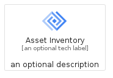
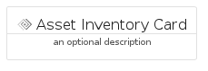
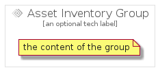

# AssetInventory


```text
gcp/Item/AssetInventory
```

```text
include('gcp/Item/AssetInventory')
```


| Illustration | AssetInventory | AssetInventoryCard | AssetInventoryGroup |
| :---: | :---: | :---: | :---: |
|  |  |  |  |


## AssetInventory

### Load remotely
```plantuml
@startuml
' configures the library
!global $LIB_BASE_LOCATION="https://raw.githubusercontent.com/tmorin/plantuml-libs/master/distribution"

' loads the library's bootstrap
!include $LIB_BASE_LOCATION/bootstrap.puml

' loads the package bootstrap
include('gcp/bootstrap')

' loads the Item which embeds the element AssetInventory
include('gcp/Item/AssetInventory')

' renders the element
AssetInventory('AssetInventory', 'Asset Inventory', 'an optional tech label')
@enduml
```

### Load locally
```plantuml
@startuml
' configures the library
!global $INCLUSION_MODE="local"
!global $LIB_BASE_LOCATION="../.."

' loads the library's bootstrap
!include $LIB_BASE_LOCATION/bootstrap.puml

' loads the package bootstrap
include('gcp/bootstrap')

' loads the Item which embeds the element AssetInventory
include('gcp/Item/AssetInventory')

' renders the element
AssetInventory('AssetInventory', 'Asset Inventory', 'an optional tech label')
@enduml
```

## AssetInventoryCard

### Load remotely
```plantuml
@startuml
' configures the library
!global $LIB_BASE_LOCATION="https://raw.githubusercontent.com/tmorin/plantuml-libs/master/distribution"

' loads the library's bootstrap
!include $LIB_BASE_LOCATION/bootstrap.puml

' loads the package bootstrap
include('gcp/bootstrap')

' loads the Item which embeds the element AssetInventoryCard
include('gcp/Item/AssetInventory')

' renders the element
AssetInventoryCard('AssetInventoryCard', 'Asset Inventory Card', 'an optional description')
@enduml
```

### Load locally
```plantuml
@startuml
' configures the library
!global $INCLUSION_MODE="local"
!global $LIB_BASE_LOCATION="../.."

' loads the library's bootstrap
!include $LIB_BASE_LOCATION/bootstrap.puml

' loads the package bootstrap
include('gcp/bootstrap')

' loads the Item which embeds the element AssetInventoryCard
include('gcp/Item/AssetInventory')

' renders the element
AssetInventoryCard('AssetInventoryCard', 'Asset Inventory Card', 'an optional description')
@enduml
```

## AssetInventoryGroup

### Load remotely
```plantuml
@startuml
' configures the library
!global $LIB_BASE_LOCATION="https://raw.githubusercontent.com/tmorin/plantuml-libs/master/distribution"

' loads the library's bootstrap
!include $LIB_BASE_LOCATION/bootstrap.puml

' loads the package bootstrap
include('gcp/bootstrap')

' loads the Item which embeds the element AssetInventoryGroup
include('gcp/Item/AssetInventory')

' renders the element
AssetInventoryGroup('AssetInventoryGroup', 'Asset Inventory Group', 'an optional tech label') {
    note as note
        the content of the group
    end note
}
@enduml
```

### Load locally
```plantuml
@startuml
' configures the library
!global $INCLUSION_MODE="local"
!global $LIB_BASE_LOCATION="../.."

' loads the library's bootstrap
!include $LIB_BASE_LOCATION/bootstrap.puml

' loads the package bootstrap
include('gcp/bootstrap')

' loads the Item which embeds the element AssetInventoryGroup
include('gcp/Item/AssetInventory')

' renders the element
AssetInventoryGroup('AssetInventoryGroup', 'Asset Inventory Group', 'an optional tech label') {
    note as note
        the content of the group
    end note
}
@enduml
```

