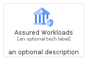
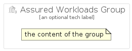

# AssuredWorkloads


```text
gcp/Item/AssuredWorkloads
```

```text
include('gcp/Item/AssuredWorkloads')
```


| Illustration | AssuredWorkloads | AssuredWorkloadsCard | AssuredWorkloadsGroup |
| :---: | :---: | :---: | :---: |
|  |  |  |  |


## AssuredWorkloads

### Load remotely
```plantuml
@startuml
' configures the library
!global $LIB_BASE_LOCATION="https://raw.githubusercontent.com/tmorin/plantuml-libs/master/distribution"

' loads the library's bootstrap
!include $LIB_BASE_LOCATION/bootstrap.puml

' loads the package bootstrap
include('gcp/bootstrap')

' loads the Item which embeds the element AssuredWorkloads
include('gcp/Item/AssuredWorkloads')

' renders the element
AssuredWorkloads('AssuredWorkloads', 'Assured Workloads', 'an optional tech label', 'an optional description')
@enduml
```

### Load locally
```plantuml
@startuml
' configures the library
!global $INCLUSION_MODE="local"
!global $LIB_BASE_LOCATION="../.."

' loads the library's bootstrap
!include $LIB_BASE_LOCATION/bootstrap.puml

' loads the package bootstrap
include('gcp/bootstrap')

' loads the Item which embeds the element AssuredWorkloads
include('gcp/Item/AssuredWorkloads')

' renders the element
AssuredWorkloads('AssuredWorkloads', 'Assured Workloads', 'an optional tech label', 'an optional description')
@enduml
```

## AssuredWorkloadsCard

### Load remotely
```plantuml
@startuml
' configures the library
!global $LIB_BASE_LOCATION="https://raw.githubusercontent.com/tmorin/plantuml-libs/master/distribution"

' loads the library's bootstrap
!include $LIB_BASE_LOCATION/bootstrap.puml

' loads the package bootstrap
include('gcp/bootstrap')

' loads the Item which embeds the element AssuredWorkloadsCard
include('gcp/Item/AssuredWorkloads')

' renders the element
AssuredWorkloadsCard('AssuredWorkloadsCard', 'Assured Workloads Card', 'an optional description')
@enduml
```

### Load locally
```plantuml
@startuml
' configures the library
!global $INCLUSION_MODE="local"
!global $LIB_BASE_LOCATION="../.."

' loads the library's bootstrap
!include $LIB_BASE_LOCATION/bootstrap.puml

' loads the package bootstrap
include('gcp/bootstrap')

' loads the Item which embeds the element AssuredWorkloadsCard
include('gcp/Item/AssuredWorkloads')

' renders the element
AssuredWorkloadsCard('AssuredWorkloadsCard', 'Assured Workloads Card', 'an optional description')
@enduml
```

## AssuredWorkloadsGroup

### Load remotely
```plantuml
@startuml
' configures the library
!global $LIB_BASE_LOCATION="https://raw.githubusercontent.com/tmorin/plantuml-libs/master/distribution"

' loads the library's bootstrap
!include $LIB_BASE_LOCATION/bootstrap.puml

' loads the package bootstrap
include('gcp/bootstrap')

' loads the Item which embeds the element AssuredWorkloadsGroup
include('gcp/Item/AssuredWorkloads')

' renders the element
AssuredWorkloadsGroup('AssuredWorkloadsGroup', 'Assured Workloads Group', 'an optional tech label') {
    note as note
        the content of the group
    end note
}
@enduml
```

### Load locally
```plantuml
@startuml
' configures the library
!global $INCLUSION_MODE="local"
!global $LIB_BASE_LOCATION="../.."

' loads the library's bootstrap
!include $LIB_BASE_LOCATION/bootstrap.puml

' loads the package bootstrap
include('gcp/bootstrap')

' loads the Item which embeds the element AssuredWorkloadsGroup
include('gcp/Item/AssuredWorkloads')

' renders the element
AssuredWorkloadsGroup('AssuredWorkloadsGroup', 'Assured Workloads Group', 'an optional tech label') {
    note as note
        the content of the group
    end note
}
@enduml
```

