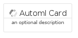
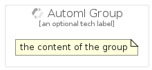

# Automl


```text
gcp/Item/Automl
```

```text
include('gcp/Item/Automl')
```


| Illustration | Automl | AutomlCard | AutomlGroup |
| :---: | :---: | :---: | :---: |
|  |  |  |  |


## Automl

### Load remotely
```plantuml
@startuml
' configures the library
!global $LIB_BASE_LOCATION="https://raw.githubusercontent.com/tmorin/plantuml-libs/master/distribution"

' loads the library's bootstrap
!include $LIB_BASE_LOCATION/bootstrap.puml

' loads the package bootstrap
include('gcp/bootstrap')

' loads the Item which embeds the element Automl
include('gcp/Item/Automl')

' renders the element
Automl('Automl', 'Automl', 'an optional tech label')
@enduml
```

### Load locally
```plantuml
@startuml
' configures the library
!global $INCLUSION_MODE="local"
!global $LIB_BASE_LOCATION="../.."

' loads the library's bootstrap
!include $LIB_BASE_LOCATION/bootstrap.puml

' loads the package bootstrap
include('gcp/bootstrap')

' loads the Item which embeds the element Automl
include('gcp/Item/Automl')

' renders the element
Automl('Automl', 'Automl', 'an optional tech label')
@enduml
```

## AutomlCard

### Load remotely
```plantuml
@startuml
' configures the library
!global $LIB_BASE_LOCATION="https://raw.githubusercontent.com/tmorin/plantuml-libs/master/distribution"

' loads the library's bootstrap
!include $LIB_BASE_LOCATION/bootstrap.puml

' loads the package bootstrap
include('gcp/bootstrap')

' loads the Item which embeds the element AutomlCard
include('gcp/Item/Automl')

' renders the element
AutomlCard('AutomlCard', 'Automl Card', 'an optional description')
@enduml
```

### Load locally
```plantuml
@startuml
' configures the library
!global $INCLUSION_MODE="local"
!global $LIB_BASE_LOCATION="../.."

' loads the library's bootstrap
!include $LIB_BASE_LOCATION/bootstrap.puml

' loads the package bootstrap
include('gcp/bootstrap')

' loads the Item which embeds the element AutomlCard
include('gcp/Item/Automl')

' renders the element
AutomlCard('AutomlCard', 'Automl Card', 'an optional description')
@enduml
```

## AutomlGroup

### Load remotely
```plantuml
@startuml
' configures the library
!global $LIB_BASE_LOCATION="https://raw.githubusercontent.com/tmorin/plantuml-libs/master/distribution"

' loads the library's bootstrap
!include $LIB_BASE_LOCATION/bootstrap.puml

' loads the package bootstrap
include('gcp/bootstrap')

' loads the Item which embeds the element AutomlGroup
include('gcp/Item/Automl')

' renders the element
AutomlGroup('AutomlGroup', 'Automl Group', 'an optional tech label') {
    note as note
        the content of the group
    end note
}
@enduml
```

### Load locally
```plantuml
@startuml
' configures the library
!global $INCLUSION_MODE="local"
!global $LIB_BASE_LOCATION="../.."

' loads the library's bootstrap
!include $LIB_BASE_LOCATION/bootstrap.puml

' loads the package bootstrap
include('gcp/bootstrap')

' loads the Item which embeds the element AutomlGroup
include('gcp/Item/Automl')

' renders the element
AutomlGroup('AutomlGroup', 'Automl Group', 'an optional tech label') {
    note as note
        the content of the group
    end note
}
@enduml
```

