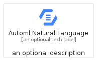
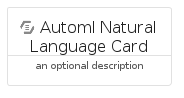
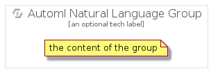

# AutomlNaturalLanguage


```text
gcp/Item/AutomlNaturalLanguage
```

```text
include('gcp/Item/AutomlNaturalLanguage')
```


| Illustration | AutomlNaturalLanguage | AutomlNaturalLanguageCard | AutomlNaturalLanguageGroup |
| :---: | :---: | :---: | :---: |
|  |  |  |  |


## Sprites
The item provides the following sriptes:

- `<$AutomlNaturalLanguageXs>`
- `<$AutomlNaturalLanguageSm>`
- `<$AutomlNaturalLanguageMd>`
- `<$AutomlNaturalLanguageLg>`


## AutomlNaturalLanguage

### Load remotely
```plantuml
@startuml
' configures the library
!global $LIB_BASE_LOCATION="https://raw.githubusercontent.com/tmorin/plantuml-libs/master/distribution"

' loads the library's bootstrap
!include $LIB_BASE_LOCATION/bootstrap.puml

' loads the package bootstrap
include('gcp/bootstrap')

' loads the Item which embeds the element AutomlNaturalLanguage
include('gcp/Item/AutomlNaturalLanguage')

' renders the element
AutomlNaturalLanguage('AutomlNaturalLanguage', 'Automl Natural Language', 'an optional tech label', 'an optional description')
@enduml
```

### Load locally
```plantuml
@startuml
' configures the library
!global $INCLUSION_MODE="local"
!global $LIB_BASE_LOCATION="../.."

' loads the library's bootstrap
!include $LIB_BASE_LOCATION/bootstrap.puml

' loads the package bootstrap
include('gcp/bootstrap')

' loads the Item which embeds the element AutomlNaturalLanguage
include('gcp/Item/AutomlNaturalLanguage')

' renders the element
AutomlNaturalLanguage('AutomlNaturalLanguage', 'Automl Natural Language', 'an optional tech label', 'an optional description')
@enduml
```

## AutomlNaturalLanguageCard

### Load remotely
```plantuml
@startuml
' configures the library
!global $LIB_BASE_LOCATION="https://raw.githubusercontent.com/tmorin/plantuml-libs/master/distribution"

' loads the library's bootstrap
!include $LIB_BASE_LOCATION/bootstrap.puml

' loads the package bootstrap
include('gcp/bootstrap')

' loads the Item which embeds the element AutomlNaturalLanguageCard
include('gcp/Item/AutomlNaturalLanguage')

' renders the element
AutomlNaturalLanguageCard('AutomlNaturalLanguageCard', 'Automl Natural Language Card', 'an optional description')
@enduml
```

### Load locally
```plantuml
@startuml
' configures the library
!global $INCLUSION_MODE="local"
!global $LIB_BASE_LOCATION="../.."

' loads the library's bootstrap
!include $LIB_BASE_LOCATION/bootstrap.puml

' loads the package bootstrap
include('gcp/bootstrap')

' loads the Item which embeds the element AutomlNaturalLanguageCard
include('gcp/Item/AutomlNaturalLanguage')

' renders the element
AutomlNaturalLanguageCard('AutomlNaturalLanguageCard', 'Automl Natural Language Card', 'an optional description')
@enduml
```

## AutomlNaturalLanguageGroup

### Load remotely
```plantuml
@startuml
' configures the library
!global $LIB_BASE_LOCATION="https://raw.githubusercontent.com/tmorin/plantuml-libs/master/distribution"

' loads the library's bootstrap
!include $LIB_BASE_LOCATION/bootstrap.puml

' loads the package bootstrap
include('gcp/bootstrap')

' loads the Item which embeds the element AutomlNaturalLanguageGroup
include('gcp/Item/AutomlNaturalLanguage')

' renders the element
AutomlNaturalLanguageGroup('AutomlNaturalLanguageGroup', 'Automl Natural Language Group', 'an optional tech label') {
    note as note
        the content of the group
    end note
}
@enduml
```

### Load locally
```plantuml
@startuml
' configures the library
!global $INCLUSION_MODE="local"
!global $LIB_BASE_LOCATION="../.."

' loads the library's bootstrap
!include $LIB_BASE_LOCATION/bootstrap.puml

' loads the package bootstrap
include('gcp/bootstrap')

' loads the Item which embeds the element AutomlNaturalLanguageGroup
include('gcp/Item/AutomlNaturalLanguage')

' renders the element
AutomlNaturalLanguageGroup('AutomlNaturalLanguageGroup', 'Automl Natural Language Group', 'an optional tech label') {
    note as note
        the content of the group
    end note
}
@enduml
```

