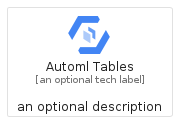
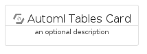
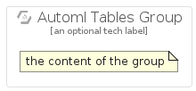

# AutomlTables


```text
gcp/Item/AutomlTables
```

```text
include('gcp/Item/AutomlTables')
```


| Illustration | AutomlTables | AutomlTablesCard | AutomlTablesGroup |
| :---: | :---: | :---: | :---: |
|  |  |  |  |


## AutomlTables

### Load remotely
```plantuml
@startuml
' configures the library
!global $LIB_BASE_LOCATION="https://raw.githubusercontent.com/tmorin/plantuml-libs/master/distribution"

' loads the library's bootstrap
!include $LIB_BASE_LOCATION/bootstrap.puml

' loads the package bootstrap
include('gcp/bootstrap')

' loads the Item which embeds the element AutomlTables
include('gcp/Item/AutomlTables')

' renders the element
AutomlTables('AutomlTables', 'Automl Tables', 'an optional tech label', 'an optional description')
@enduml
```

### Load locally
```plantuml
@startuml
' configures the library
!global $INCLUSION_MODE="local"
!global $LIB_BASE_LOCATION="../.."

' loads the library's bootstrap
!include $LIB_BASE_LOCATION/bootstrap.puml

' loads the package bootstrap
include('gcp/bootstrap')

' loads the Item which embeds the element AutomlTables
include('gcp/Item/AutomlTables')

' renders the element
AutomlTables('AutomlTables', 'Automl Tables', 'an optional tech label', 'an optional description')
@enduml
```

## AutomlTablesCard

### Load remotely
```plantuml
@startuml
' configures the library
!global $LIB_BASE_LOCATION="https://raw.githubusercontent.com/tmorin/plantuml-libs/master/distribution"

' loads the library's bootstrap
!include $LIB_BASE_LOCATION/bootstrap.puml

' loads the package bootstrap
include('gcp/bootstrap')

' loads the Item which embeds the element AutomlTablesCard
include('gcp/Item/AutomlTables')

' renders the element
AutomlTablesCard('AutomlTablesCard', 'Automl Tables Card', 'an optional description')
@enduml
```

### Load locally
```plantuml
@startuml
' configures the library
!global $INCLUSION_MODE="local"
!global $LIB_BASE_LOCATION="../.."

' loads the library's bootstrap
!include $LIB_BASE_LOCATION/bootstrap.puml

' loads the package bootstrap
include('gcp/bootstrap')

' loads the Item which embeds the element AutomlTablesCard
include('gcp/Item/AutomlTables')

' renders the element
AutomlTablesCard('AutomlTablesCard', 'Automl Tables Card', 'an optional description')
@enduml
```

## AutomlTablesGroup

### Load remotely
```plantuml
@startuml
' configures the library
!global $LIB_BASE_LOCATION="https://raw.githubusercontent.com/tmorin/plantuml-libs/master/distribution"

' loads the library's bootstrap
!include $LIB_BASE_LOCATION/bootstrap.puml

' loads the package bootstrap
include('gcp/bootstrap')

' loads the Item which embeds the element AutomlTablesGroup
include('gcp/Item/AutomlTables')

' renders the element
AutomlTablesGroup('AutomlTablesGroup', 'Automl Tables Group', 'an optional tech label') {
    note as note
        the content of the group
    end note
}
@enduml
```

### Load locally
```plantuml
@startuml
' configures the library
!global $INCLUSION_MODE="local"
!global $LIB_BASE_LOCATION="../.."

' loads the library's bootstrap
!include $LIB_BASE_LOCATION/bootstrap.puml

' loads the package bootstrap
include('gcp/bootstrap')

' loads the Item which embeds the element AutomlTablesGroup
include('gcp/Item/AutomlTables')

' renders the element
AutomlTablesGroup('AutomlTablesGroup', 'Automl Tables Group', 'an optional tech label') {
    note as note
        the content of the group
    end note
}
@enduml
```

