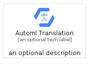
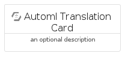
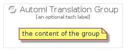

# AutomlTranslation


```text
gcp/Item/AutomlTranslation
```

```text
include('gcp/Item/AutomlTranslation')
```


| Illustration | AutomlTranslation | AutomlTranslationCard | AutomlTranslationGroup |
| :---: | :---: | :---: | :---: |
|  |  |  |  |


## Sprites
The item provides the following sriptes:

- `<$AutomlTranslationXs>`
- `<$AutomlTranslationSm>`
- `<$AutomlTranslationMd>`
- `<$AutomlTranslationLg>`


## AutomlTranslation

### Load remotely
```plantuml
@startuml
' configures the library
!global $LIB_BASE_LOCATION="https://raw.githubusercontent.com/tmorin/plantuml-libs/master/distribution"

' loads the library's bootstrap
!include $LIB_BASE_LOCATION/bootstrap.puml

' loads the package bootstrap
include('gcp/bootstrap')

' loads the Item which embeds the element AutomlTranslation
include('gcp/Item/AutomlTranslation')

' renders the element
AutomlTranslation('AutomlTranslation', 'Automl Translation', 'an optional tech label', 'an optional description')
@enduml
```

### Load locally
```plantuml
@startuml
' configures the library
!global $INCLUSION_MODE="local"
!global $LIB_BASE_LOCATION="../.."

' loads the library's bootstrap
!include $LIB_BASE_LOCATION/bootstrap.puml

' loads the package bootstrap
include('gcp/bootstrap')

' loads the Item which embeds the element AutomlTranslation
include('gcp/Item/AutomlTranslation')

' renders the element
AutomlTranslation('AutomlTranslation', 'Automl Translation', 'an optional tech label', 'an optional description')
@enduml
```

## AutomlTranslationCard

### Load remotely
```plantuml
@startuml
' configures the library
!global $LIB_BASE_LOCATION="https://raw.githubusercontent.com/tmorin/plantuml-libs/master/distribution"

' loads the library's bootstrap
!include $LIB_BASE_LOCATION/bootstrap.puml

' loads the package bootstrap
include('gcp/bootstrap')

' loads the Item which embeds the element AutomlTranslationCard
include('gcp/Item/AutomlTranslation')

' renders the element
AutomlTranslationCard('AutomlTranslationCard', 'Automl Translation Card', 'an optional description')
@enduml
```

### Load locally
```plantuml
@startuml
' configures the library
!global $INCLUSION_MODE="local"
!global $LIB_BASE_LOCATION="../.."

' loads the library's bootstrap
!include $LIB_BASE_LOCATION/bootstrap.puml

' loads the package bootstrap
include('gcp/bootstrap')

' loads the Item which embeds the element AutomlTranslationCard
include('gcp/Item/AutomlTranslation')

' renders the element
AutomlTranslationCard('AutomlTranslationCard', 'Automl Translation Card', 'an optional description')
@enduml
```

## AutomlTranslationGroup

### Load remotely
```plantuml
@startuml
' configures the library
!global $LIB_BASE_LOCATION="https://raw.githubusercontent.com/tmorin/plantuml-libs/master/distribution"

' loads the library's bootstrap
!include $LIB_BASE_LOCATION/bootstrap.puml

' loads the package bootstrap
include('gcp/bootstrap')

' loads the Item which embeds the element AutomlTranslationGroup
include('gcp/Item/AutomlTranslation')

' renders the element
AutomlTranslationGroup('AutomlTranslationGroup', 'Automl Translation Group', 'an optional tech label') {
    note as note
        the content of the group
    end note
}
@enduml
```

### Load locally
```plantuml
@startuml
' configures the library
!global $INCLUSION_MODE="local"
!global $LIB_BASE_LOCATION="../.."

' loads the library's bootstrap
!include $LIB_BASE_LOCATION/bootstrap.puml

' loads the package bootstrap
include('gcp/bootstrap')

' loads the Item which embeds the element AutomlTranslationGroup
include('gcp/Item/AutomlTranslation')

' renders the element
AutomlTranslationGroup('AutomlTranslationGroup', 'Automl Translation Group', 'an optional tech label') {
    note as note
        the content of the group
    end note
}
@enduml
```

