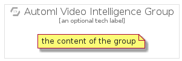

# AutomlVideoIntelligence


```text
gcp/Item/AutomlVideoIntelligence
```

```text
include('gcp/Item/AutomlVideoIntelligence')
```


| Illustration | AutomlVideoIntelligence | AutomlVideoIntelligenceCard | AutomlVideoIntelligenceGroup |
| :---: | :---: | :---: | :---: |
|  |  |  |  |


## AutomlVideoIntelligence

### Load remotely
```plantuml
@startuml
' configures the library
!global $LIB_BASE_LOCATION="https://raw.githubusercontent.com/tmorin/plantuml-libs/master/distribution"

' loads the library's bootstrap
!include $LIB_BASE_LOCATION/bootstrap.puml

' loads the package bootstrap
include('gcp/bootstrap')

' loads the Item which embeds the element AutomlVideoIntelligence
include('gcp/Item/AutomlVideoIntelligence')

' renders the element
AutomlVideoIntelligence('AutomlVideoIntelligence', 'Automl Video Intelligence', 'an optional tech label')
@enduml
```

### Load locally
```plantuml
@startuml
' configures the library
!global $INCLUSION_MODE="local"
!global $LIB_BASE_LOCATION="../.."

' loads the library's bootstrap
!include $LIB_BASE_LOCATION/bootstrap.puml

' loads the package bootstrap
include('gcp/bootstrap')

' loads the Item which embeds the element AutomlVideoIntelligence
include('gcp/Item/AutomlVideoIntelligence')

' renders the element
AutomlVideoIntelligence('AutomlVideoIntelligence', 'Automl Video Intelligence', 'an optional tech label')
@enduml
```

## AutomlVideoIntelligenceCard

### Load remotely
```plantuml
@startuml
' configures the library
!global $LIB_BASE_LOCATION="https://raw.githubusercontent.com/tmorin/plantuml-libs/master/distribution"

' loads the library's bootstrap
!include $LIB_BASE_LOCATION/bootstrap.puml

' loads the package bootstrap
include('gcp/bootstrap')

' loads the Item which embeds the element AutomlVideoIntelligenceCard
include('gcp/Item/AutomlVideoIntelligence')

' renders the element
AutomlVideoIntelligenceCard('AutomlVideoIntelligenceCard', 'Automl Video Intelligence Card', 'an optional description')
@enduml
```

### Load locally
```plantuml
@startuml
' configures the library
!global $INCLUSION_MODE="local"
!global $LIB_BASE_LOCATION="../.."

' loads the library's bootstrap
!include $LIB_BASE_LOCATION/bootstrap.puml

' loads the package bootstrap
include('gcp/bootstrap')

' loads the Item which embeds the element AutomlVideoIntelligenceCard
include('gcp/Item/AutomlVideoIntelligence')

' renders the element
AutomlVideoIntelligenceCard('AutomlVideoIntelligenceCard', 'Automl Video Intelligence Card', 'an optional description')
@enduml
```

## AutomlVideoIntelligenceGroup

### Load remotely
```plantuml
@startuml
' configures the library
!global $LIB_BASE_LOCATION="https://raw.githubusercontent.com/tmorin/plantuml-libs/master/distribution"

' loads the library's bootstrap
!include $LIB_BASE_LOCATION/bootstrap.puml

' loads the package bootstrap
include('gcp/bootstrap')

' loads the Item which embeds the element AutomlVideoIntelligenceGroup
include('gcp/Item/AutomlVideoIntelligence')

' renders the element
AutomlVideoIntelligenceGroup('AutomlVideoIntelligenceGroup', 'Automl Video Intelligence Group', 'an optional tech label') {
    note as note
        the content of the group
    end note
}
@enduml
```

### Load locally
```plantuml
@startuml
' configures the library
!global $INCLUSION_MODE="local"
!global $LIB_BASE_LOCATION="../.."

' loads the library's bootstrap
!include $LIB_BASE_LOCATION/bootstrap.puml

' loads the package bootstrap
include('gcp/bootstrap')

' loads the Item which embeds the element AutomlVideoIntelligenceGroup
include('gcp/Item/AutomlVideoIntelligence')

' renders the element
AutomlVideoIntelligenceGroup('AutomlVideoIntelligenceGroup', 'Automl Video Intelligence Group', 'an optional tech label') {
    note as note
        the content of the group
    end note
}
@enduml
```

