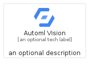
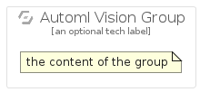

# AutomlVision


```text
gcp/Item/AutomlVision
```

```text
include('gcp/Item/AutomlVision')
```


| Illustration | AutomlVision | AutomlVisionCard | AutomlVisionGroup |
| :---: | :---: | :---: | :---: |
|  |  |  |  |


## AutomlVision

### Load remotely
```plantuml
@startuml
' configures the library
!global $LIB_BASE_LOCATION="https://raw.githubusercontent.com/tmorin/plantuml-libs/master/distribution"

' loads the library's bootstrap
!include $LIB_BASE_LOCATION/bootstrap.puml

' loads the package bootstrap
include('gcp/bootstrap')

' loads the Item which embeds the element AutomlVision
include('gcp/Item/AutomlVision')

' renders the element
AutomlVision('AutomlVision', 'Automl Vision', 'an optional tech label')
@enduml
```

### Load locally
```plantuml
@startuml
' configures the library
!global $INCLUSION_MODE="local"
!global $LIB_BASE_LOCATION="../.."

' loads the library's bootstrap
!include $LIB_BASE_LOCATION/bootstrap.puml

' loads the package bootstrap
include('gcp/bootstrap')

' loads the Item which embeds the element AutomlVision
include('gcp/Item/AutomlVision')

' renders the element
AutomlVision('AutomlVision', 'Automl Vision', 'an optional tech label')
@enduml
```

## AutomlVisionCard

### Load remotely
```plantuml
@startuml
' configures the library
!global $LIB_BASE_LOCATION="https://raw.githubusercontent.com/tmorin/plantuml-libs/master/distribution"

' loads the library's bootstrap
!include $LIB_BASE_LOCATION/bootstrap.puml

' loads the package bootstrap
include('gcp/bootstrap')

' loads the Item which embeds the element AutomlVisionCard
include('gcp/Item/AutomlVision')

' renders the element
AutomlVisionCard('AutomlVisionCard', 'Automl Vision Card', 'an optional description')
@enduml
```

### Load locally
```plantuml
@startuml
' configures the library
!global $INCLUSION_MODE="local"
!global $LIB_BASE_LOCATION="../.."

' loads the library's bootstrap
!include $LIB_BASE_LOCATION/bootstrap.puml

' loads the package bootstrap
include('gcp/bootstrap')

' loads the Item which embeds the element AutomlVisionCard
include('gcp/Item/AutomlVision')

' renders the element
AutomlVisionCard('AutomlVisionCard', 'Automl Vision Card', 'an optional description')
@enduml
```

## AutomlVisionGroup

### Load remotely
```plantuml
@startuml
' configures the library
!global $LIB_BASE_LOCATION="https://raw.githubusercontent.com/tmorin/plantuml-libs/master/distribution"

' loads the library's bootstrap
!include $LIB_BASE_LOCATION/bootstrap.puml

' loads the package bootstrap
include('gcp/bootstrap')

' loads the Item which embeds the element AutomlVisionGroup
include('gcp/Item/AutomlVision')

' renders the element
AutomlVisionGroup('AutomlVisionGroup', 'Automl Vision Group', 'an optional tech label') {
    note as note
        the content of the group
    end note
}
@enduml
```

### Load locally
```plantuml
@startuml
' configures the library
!global $INCLUSION_MODE="local"
!global $LIB_BASE_LOCATION="../.."

' loads the library's bootstrap
!include $LIB_BASE_LOCATION/bootstrap.puml

' loads the package bootstrap
include('gcp/bootstrap')

' loads the Item which embeds the element AutomlVisionGroup
include('gcp/Item/AutomlVision')

' renders the element
AutomlVisionGroup('AutomlVisionGroup', 'Automl Vision Group', 'an optional tech label') {
    note as note
        the content of the group
    end note
}
@enduml
```

