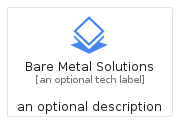
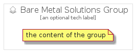

# BareMetalSolutions


```text
gcp/Item/BareMetalSolutions
```

```text
include('gcp/Item/BareMetalSolutions')
```


| Illustration | BareMetalSolutions | BareMetalSolutionsCard | BareMetalSolutionsGroup |
| :---: | :---: | :---: | :---: |
|  |  |  |  |


## BareMetalSolutions

### Load remotely
```plantuml
@startuml
' configures the library
!global $LIB_BASE_LOCATION="https://raw.githubusercontent.com/tmorin/plantuml-libs/master/distribution"

' loads the library's bootstrap
!include $LIB_BASE_LOCATION/bootstrap.puml

' loads the package bootstrap
include('gcp/bootstrap')

' loads the Item which embeds the element BareMetalSolutions
include('gcp/Item/BareMetalSolutions')

' renders the element
BareMetalSolutions('BareMetalSolutions', 'Bare Metal Solutions', 'an optional tech label', 'an optional description')
@enduml
```

### Load locally
```plantuml
@startuml
' configures the library
!global $INCLUSION_MODE="local"
!global $LIB_BASE_LOCATION="../.."

' loads the library's bootstrap
!include $LIB_BASE_LOCATION/bootstrap.puml

' loads the package bootstrap
include('gcp/bootstrap')

' loads the Item which embeds the element BareMetalSolutions
include('gcp/Item/BareMetalSolutions')

' renders the element
BareMetalSolutions('BareMetalSolutions', 'Bare Metal Solutions', 'an optional tech label', 'an optional description')
@enduml
```

## BareMetalSolutionsCard

### Load remotely
```plantuml
@startuml
' configures the library
!global $LIB_BASE_LOCATION="https://raw.githubusercontent.com/tmorin/plantuml-libs/master/distribution"

' loads the library's bootstrap
!include $LIB_BASE_LOCATION/bootstrap.puml

' loads the package bootstrap
include('gcp/bootstrap')

' loads the Item which embeds the element BareMetalSolutionsCard
include('gcp/Item/BareMetalSolutions')

' renders the element
BareMetalSolutionsCard('BareMetalSolutionsCard', 'Bare Metal Solutions Card', 'an optional description')
@enduml
```

### Load locally
```plantuml
@startuml
' configures the library
!global $INCLUSION_MODE="local"
!global $LIB_BASE_LOCATION="../.."

' loads the library's bootstrap
!include $LIB_BASE_LOCATION/bootstrap.puml

' loads the package bootstrap
include('gcp/bootstrap')

' loads the Item which embeds the element BareMetalSolutionsCard
include('gcp/Item/BareMetalSolutions')

' renders the element
BareMetalSolutionsCard('BareMetalSolutionsCard', 'Bare Metal Solutions Card', 'an optional description')
@enduml
```

## BareMetalSolutionsGroup

### Load remotely
```plantuml
@startuml
' configures the library
!global $LIB_BASE_LOCATION="https://raw.githubusercontent.com/tmorin/plantuml-libs/master/distribution"

' loads the library's bootstrap
!include $LIB_BASE_LOCATION/bootstrap.puml

' loads the package bootstrap
include('gcp/bootstrap')

' loads the Item which embeds the element BareMetalSolutionsGroup
include('gcp/Item/BareMetalSolutions')

' renders the element
BareMetalSolutionsGroup('BareMetalSolutionsGroup', 'Bare Metal Solutions Group', 'an optional tech label') {
    note as note
        the content of the group
    end note
}
@enduml
```

### Load locally
```plantuml
@startuml
' configures the library
!global $INCLUSION_MODE="local"
!global $LIB_BASE_LOCATION="../.."

' loads the library's bootstrap
!include $LIB_BASE_LOCATION/bootstrap.puml

' loads the package bootstrap
include('gcp/bootstrap')

' loads the Item which embeds the element BareMetalSolutionsGroup
include('gcp/Item/BareMetalSolutions')

' renders the element
BareMetalSolutionsGroup('BareMetalSolutionsGroup', 'Bare Metal Solutions Group', 'an optional tech label') {
    note as note
        the content of the group
    end note
}
@enduml
```

