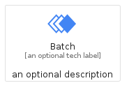
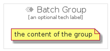

# Batch


```text
gcp/Item/Batch
```

```text
include('gcp/Item/Batch')
```


| Illustration | Batch | BatchCard | BatchGroup |
| :---: | :---: | :---: | :---: |
|  |  |  |  |


## Sprites
The item provides the following sriptes:

- `<$BatchXs>`
- `<$BatchSm>`
- `<$BatchMd>`
- `<$BatchLg>`


## Batch

### Load remotely
```plantuml
@startuml
' configures the library
!global $LIB_BASE_LOCATION="https://raw.githubusercontent.com/tmorin/plantuml-libs/master/distribution"

' loads the library's bootstrap
!include $LIB_BASE_LOCATION/bootstrap.puml

' loads the package bootstrap
include('gcp/bootstrap')

' loads the Item which embeds the element Batch
include('gcp/Item/Batch')

' renders the element
Batch('Batch', 'Batch', 'an optional tech label', 'an optional description')
@enduml
```

### Load locally
```plantuml
@startuml
' configures the library
!global $INCLUSION_MODE="local"
!global $LIB_BASE_LOCATION="../.."

' loads the library's bootstrap
!include $LIB_BASE_LOCATION/bootstrap.puml

' loads the package bootstrap
include('gcp/bootstrap')

' loads the Item which embeds the element Batch
include('gcp/Item/Batch')

' renders the element
Batch('Batch', 'Batch', 'an optional tech label', 'an optional description')
@enduml
```

## BatchCard

### Load remotely
```plantuml
@startuml
' configures the library
!global $LIB_BASE_LOCATION="https://raw.githubusercontent.com/tmorin/plantuml-libs/master/distribution"

' loads the library's bootstrap
!include $LIB_BASE_LOCATION/bootstrap.puml

' loads the package bootstrap
include('gcp/bootstrap')

' loads the Item which embeds the element BatchCard
include('gcp/Item/Batch')

' renders the element
BatchCard('BatchCard', 'Batch Card', 'an optional description')
@enduml
```

### Load locally
```plantuml
@startuml
' configures the library
!global $INCLUSION_MODE="local"
!global $LIB_BASE_LOCATION="../.."

' loads the library's bootstrap
!include $LIB_BASE_LOCATION/bootstrap.puml

' loads the package bootstrap
include('gcp/bootstrap')

' loads the Item which embeds the element BatchCard
include('gcp/Item/Batch')

' renders the element
BatchCard('BatchCard', 'Batch Card', 'an optional description')
@enduml
```

## BatchGroup

### Load remotely
```plantuml
@startuml
' configures the library
!global $LIB_BASE_LOCATION="https://raw.githubusercontent.com/tmorin/plantuml-libs/master/distribution"

' loads the library's bootstrap
!include $LIB_BASE_LOCATION/bootstrap.puml

' loads the package bootstrap
include('gcp/bootstrap')

' loads the Item which embeds the element BatchGroup
include('gcp/Item/Batch')

' renders the element
BatchGroup('BatchGroup', 'Batch Group', 'an optional tech label') {
    note as note
        the content of the group
    end note
}
@enduml
```

### Load locally
```plantuml
@startuml
' configures the library
!global $INCLUSION_MODE="local"
!global $LIB_BASE_LOCATION="../.."

' loads the library's bootstrap
!include $LIB_BASE_LOCATION/bootstrap.puml

' loads the package bootstrap
include('gcp/bootstrap')

' loads the Item which embeds the element BatchGroup
include('gcp/Item/Batch')

' renders the element
BatchGroup('BatchGroup', 'Batch Group', 'an optional tech label') {
    note as note
        the content of the group
    end note
}
@enduml
```

