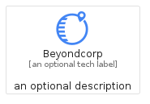
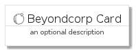
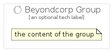

# Beyondcorp


```text
gcp/Item/Beyondcorp
```

```text
include('gcp/Item/Beyondcorp')
```


| Illustration | Beyondcorp | BeyondcorpCard | BeyondcorpGroup |
| :---: | :---: | :---: | :---: |
|  |  |  |  |


## Sprites
The item provides the following sriptes:

- `<$BeyondcorpXs>`
- `<$BeyondcorpSm>`
- `<$BeyondcorpMd>`
- `<$BeyondcorpLg>`


## Beyondcorp

### Load remotely
```plantuml
@startuml
' configures the library
!global $LIB_BASE_LOCATION="https://raw.githubusercontent.com/tmorin/plantuml-libs/master/distribution"

' loads the library's bootstrap
!include $LIB_BASE_LOCATION/bootstrap.puml

' loads the package bootstrap
include('gcp/bootstrap')

' loads the Item which embeds the element Beyondcorp
include('gcp/Item/Beyondcorp')

' renders the element
Beyondcorp('Beyondcorp', 'Beyondcorp', 'an optional tech label', 'an optional description')
@enduml
```

### Load locally
```plantuml
@startuml
' configures the library
!global $INCLUSION_MODE="local"
!global $LIB_BASE_LOCATION="../.."

' loads the library's bootstrap
!include $LIB_BASE_LOCATION/bootstrap.puml

' loads the package bootstrap
include('gcp/bootstrap')

' loads the Item which embeds the element Beyondcorp
include('gcp/Item/Beyondcorp')

' renders the element
Beyondcorp('Beyondcorp', 'Beyondcorp', 'an optional tech label', 'an optional description')
@enduml
```

## BeyondcorpCard

### Load remotely
```plantuml
@startuml
' configures the library
!global $LIB_BASE_LOCATION="https://raw.githubusercontent.com/tmorin/plantuml-libs/master/distribution"

' loads the library's bootstrap
!include $LIB_BASE_LOCATION/bootstrap.puml

' loads the package bootstrap
include('gcp/bootstrap')

' loads the Item which embeds the element BeyondcorpCard
include('gcp/Item/Beyondcorp')

' renders the element
BeyondcorpCard('BeyondcorpCard', 'Beyondcorp Card', 'an optional description')
@enduml
```

### Load locally
```plantuml
@startuml
' configures the library
!global $INCLUSION_MODE="local"
!global $LIB_BASE_LOCATION="../.."

' loads the library's bootstrap
!include $LIB_BASE_LOCATION/bootstrap.puml

' loads the package bootstrap
include('gcp/bootstrap')

' loads the Item which embeds the element BeyondcorpCard
include('gcp/Item/Beyondcorp')

' renders the element
BeyondcorpCard('BeyondcorpCard', 'Beyondcorp Card', 'an optional description')
@enduml
```

## BeyondcorpGroup

### Load remotely
```plantuml
@startuml
' configures the library
!global $LIB_BASE_LOCATION="https://raw.githubusercontent.com/tmorin/plantuml-libs/master/distribution"

' loads the library's bootstrap
!include $LIB_BASE_LOCATION/bootstrap.puml

' loads the package bootstrap
include('gcp/bootstrap')

' loads the Item which embeds the element BeyondcorpGroup
include('gcp/Item/Beyondcorp')

' renders the element
BeyondcorpGroup('BeyondcorpGroup', 'Beyondcorp Group', 'an optional tech label') {
    note as note
        the content of the group
    end note
}
@enduml
```

### Load locally
```plantuml
@startuml
' configures the library
!global $INCLUSION_MODE="local"
!global $LIB_BASE_LOCATION="../.."

' loads the library's bootstrap
!include $LIB_BASE_LOCATION/bootstrap.puml

' loads the package bootstrap
include('gcp/bootstrap')

' loads the Item which embeds the element BeyondcorpGroup
include('gcp/Item/Beyondcorp')

' renders the element
BeyondcorpGroup('BeyondcorpGroup', 'Beyondcorp Group', 'an optional tech label') {
    note as note
        the content of the group
    end note
}
@enduml
```

