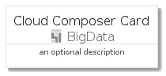
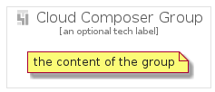

# CloudComposer


```text
gcp/Item/BigData/CloudComposer
```

```text
include('gcp/Item/BigData/CloudComposer')
```


| Illustration | CloudComposer | CloudComposerCard | CloudComposerGroup |
| :---: | :---: | :---: | :---: |
|  |  |  |  |


## CloudComposer

### Load remotely
```plantuml
@startuml
' configures the library
!global $LIB_BASE_LOCATION="https://github.com/tmorin/plantuml-libs/distribution"

' loads the library's bootstrap
!include $LIB_BASE_LOCATION/bootstrap.puml

' loads the package bootstrap
include('gcp/bootstrap')

' loads the Item which embeds the element CloudComposer
include('gcp/Item/BigData/CloudComposer')

' renders the element
CloudComposer('CloudComposer', 'Cloud Composer', 'an optional tech label')
@enduml
```

### Load locally
```plantuml
@startuml
' configures the library
!global $INCLUSION_MODE="local"
!global $LIB_BASE_LOCATION="../../.."

' loads the library's bootstrap
!include $LIB_BASE_LOCATION/bootstrap.puml

' loads the package bootstrap
include('gcp/bootstrap')

' loads the Item which embeds the element CloudComposer
include('gcp/Item/BigData/CloudComposer')

' renders the element
CloudComposer('CloudComposer', 'Cloud Composer', 'an optional tech label')
@enduml
```

## CloudComposerCard

### Load remotely
```plantuml
@startuml
' configures the library
!global $LIB_BASE_LOCATION="https://github.com/tmorin/plantuml-libs/distribution"

' loads the library's bootstrap
!include $LIB_BASE_LOCATION/bootstrap.puml

' loads the package bootstrap
include('gcp/bootstrap')

' loads the Item which embeds the element CloudComposerCard
include('gcp/Item/BigData/CloudComposer')

' renders the element
CloudComposerCard('CloudComposerCard', 'Cloud Composer Card', 'an optional description')
@enduml
```

### Load locally
```plantuml
@startuml
' configures the library
!global $INCLUSION_MODE="local"
!global $LIB_BASE_LOCATION="../../.."

' loads the library's bootstrap
!include $LIB_BASE_LOCATION/bootstrap.puml

' loads the package bootstrap
include('gcp/bootstrap')

' loads the Item which embeds the element CloudComposerCard
include('gcp/Item/BigData/CloudComposer')

' renders the element
CloudComposerCard('CloudComposerCard', 'Cloud Composer Card', 'an optional description')
@enduml
```

## CloudComposerGroup

### Load remotely
```plantuml
@startuml
' configures the library
!global $LIB_BASE_LOCATION="https://github.com/tmorin/plantuml-libs/distribution"

' loads the library's bootstrap
!include $LIB_BASE_LOCATION/bootstrap.puml

' loads the package bootstrap
include('gcp/bootstrap')

' loads the Item which embeds the element CloudComposerGroup
include('gcp/Item/BigData/CloudComposer')

' renders the element
CloudComposerGroup('CloudComposerGroup', 'Cloud Composer Group', 'an optional tech label') {
    note as note
        the content of the group
    end note
}
@enduml
```

### Load locally
```plantuml
@startuml
' configures the library
!global $INCLUSION_MODE="local"
!global $LIB_BASE_LOCATION="../../.."

' loads the library's bootstrap
!include $LIB_BASE_LOCATION/bootstrap.puml

' loads the package bootstrap
include('gcp/bootstrap')

' loads the Item which embeds the element CloudComposerGroup
include('gcp/Item/BigData/CloudComposer')

' renders the element
CloudComposerGroup('CloudComposerGroup', 'Cloud Composer Group', 'an optional tech label') {
    note as note
        the content of the group
    end note
}
@enduml
```

