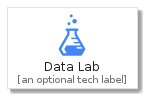
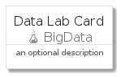
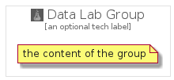

# DataLab


```text
gcp/Item/BigData/DataLab
```

```text
include('gcp/Item/BigData/DataLab')
```


| Illustration | DataLab | DataLabCard | DataLabGroup |
| :---: | :---: | :---: | :---: |
|  |  |  |  |


## DataLab

### Load remotely
```plantuml
@startuml
' configures the library
!global $LIB_BASE_LOCATION="https://github.com/tmorin/plantuml-libs/distribution"

' loads the library's bootstrap
!include $LIB_BASE_LOCATION/bootstrap.puml

' loads the package bootstrap
include('gcp/bootstrap')

' loads the Item which embeds the element DataLab
include('gcp/Item/BigData/DataLab')

' renders the element
DataLab('DataLab', 'Data Lab', 'an optional tech label')
@enduml
```

### Load locally
```plantuml
@startuml
' configures the library
!global $INCLUSION_MODE="local"
!global $LIB_BASE_LOCATION="../../.."

' loads the library's bootstrap
!include $LIB_BASE_LOCATION/bootstrap.puml

' loads the package bootstrap
include('gcp/bootstrap')

' loads the Item which embeds the element DataLab
include('gcp/Item/BigData/DataLab')

' renders the element
DataLab('DataLab', 'Data Lab', 'an optional tech label')
@enduml
```

## DataLabCard

### Load remotely
```plantuml
@startuml
' configures the library
!global $LIB_BASE_LOCATION="https://github.com/tmorin/plantuml-libs/distribution"

' loads the library's bootstrap
!include $LIB_BASE_LOCATION/bootstrap.puml

' loads the package bootstrap
include('gcp/bootstrap')

' loads the Item which embeds the element DataLabCard
include('gcp/Item/BigData/DataLab')

' renders the element
DataLabCard('DataLabCard', 'Data Lab Card', 'an optional description')
@enduml
```

### Load locally
```plantuml
@startuml
' configures the library
!global $INCLUSION_MODE="local"
!global $LIB_BASE_LOCATION="../../.."

' loads the library's bootstrap
!include $LIB_BASE_LOCATION/bootstrap.puml

' loads the package bootstrap
include('gcp/bootstrap')

' loads the Item which embeds the element DataLabCard
include('gcp/Item/BigData/DataLab')

' renders the element
DataLabCard('DataLabCard', 'Data Lab Card', 'an optional description')
@enduml
```

## DataLabGroup

### Load remotely
```plantuml
@startuml
' configures the library
!global $LIB_BASE_LOCATION="https://github.com/tmorin/plantuml-libs/distribution"

' loads the library's bootstrap
!include $LIB_BASE_LOCATION/bootstrap.puml

' loads the package bootstrap
include('gcp/bootstrap')

' loads the Item which embeds the element DataLabGroup
include('gcp/Item/BigData/DataLab')

' renders the element
DataLabGroup('DataLabGroup', 'Data Lab Group', 'an optional tech label') {
    note as note
        the content of the group
    end note
}
@enduml
```

### Load locally
```plantuml
@startuml
' configures the library
!global $INCLUSION_MODE="local"
!global $LIB_BASE_LOCATION="../../.."

' loads the library's bootstrap
!include $LIB_BASE_LOCATION/bootstrap.puml

' loads the package bootstrap
include('gcp/bootstrap')

' loads the Item which embeds the element DataLabGroup
include('gcp/Item/BigData/DataLab')

' renders the element
DataLabGroup('DataLabGroup', 'Data Lab Group', 'an optional tech label') {
    note as note
        the content of the group
    end note
}
@enduml
```

