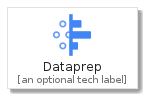
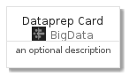
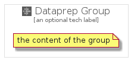

# Dataprep


```text
gcp/Item/BigData/Dataprep
```

```text
include('gcp/Item/BigData/Dataprep')
```


| Illustration | Dataprep | DataprepCard | DataprepGroup |
| :---: | :---: | :---: | :---: |
|  |  |  |  |


## Dataprep

### Load remotely
```plantuml
@startuml
' configures the library
!global $LIB_BASE_LOCATION="https://raw.githubusercontent.com/tmorin/plantuml-libs/master/distribution"

' loads the library's bootstrap
!include $LIB_BASE_LOCATION/bootstrap.puml

' loads the package bootstrap
include('gcp/bootstrap')

' loads the Item which embeds the element Dataprep
include('gcp/Item/BigData/Dataprep')

' renders the element
Dataprep('Dataprep', 'Dataprep', 'an optional tech label')
@enduml
```

### Load locally
```plantuml
@startuml
' configures the library
!global $INCLUSION_MODE="local"
!global $LIB_BASE_LOCATION="../../.."

' loads the library's bootstrap
!include $LIB_BASE_LOCATION/bootstrap.puml

' loads the package bootstrap
include('gcp/bootstrap')

' loads the Item which embeds the element Dataprep
include('gcp/Item/BigData/Dataprep')

' renders the element
Dataprep('Dataprep', 'Dataprep', 'an optional tech label')
@enduml
```

## DataprepCard

### Load remotely
```plantuml
@startuml
' configures the library
!global $LIB_BASE_LOCATION="https://raw.githubusercontent.com/tmorin/plantuml-libs/master/distribution"

' loads the library's bootstrap
!include $LIB_BASE_LOCATION/bootstrap.puml

' loads the package bootstrap
include('gcp/bootstrap')

' loads the Item which embeds the element DataprepCard
include('gcp/Item/BigData/Dataprep')

' renders the element
DataprepCard('DataprepCard', 'Dataprep Card', 'an optional description')
@enduml
```

### Load locally
```plantuml
@startuml
' configures the library
!global $INCLUSION_MODE="local"
!global $LIB_BASE_LOCATION="../../.."

' loads the library's bootstrap
!include $LIB_BASE_LOCATION/bootstrap.puml

' loads the package bootstrap
include('gcp/bootstrap')

' loads the Item which embeds the element DataprepCard
include('gcp/Item/BigData/Dataprep')

' renders the element
DataprepCard('DataprepCard', 'Dataprep Card', 'an optional description')
@enduml
```

## DataprepGroup

### Load remotely
```plantuml
@startuml
' configures the library
!global $LIB_BASE_LOCATION="https://raw.githubusercontent.com/tmorin/plantuml-libs/master/distribution"

' loads the library's bootstrap
!include $LIB_BASE_LOCATION/bootstrap.puml

' loads the package bootstrap
include('gcp/bootstrap')

' loads the Item which embeds the element DataprepGroup
include('gcp/Item/BigData/Dataprep')

' renders the element
DataprepGroup('DataprepGroup', 'Dataprep Group', 'an optional tech label') {
    note as note
        the content of the group
    end note
}
@enduml
```

### Load locally
```plantuml
@startuml
' configures the library
!global $INCLUSION_MODE="local"
!global $LIB_BASE_LOCATION="../../.."

' loads the library's bootstrap
!include $LIB_BASE_LOCATION/bootstrap.puml

' loads the package bootstrap
include('gcp/bootstrap')

' loads the Item which embeds the element DataprepGroup
include('gcp/Item/BigData/Dataprep')

' renders the element
DataprepGroup('DataprepGroup', 'Dataprep Group', 'an optional tech label') {
    note as note
        the content of the group
    end note
}
@enduml
```

