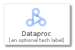
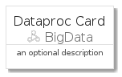
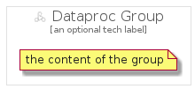

# Dataproc


```text
gcp/Item/BigData/Dataproc
```

```text
include('gcp/Item/BigData/Dataproc')
```


| Illustration | Dataproc | DataprocCard | DataprocGroup |
| :---: | :---: | :---: | :---: |
|  |  |  |  |


## Dataproc

### Load remotely
```plantuml
@startuml
' configures the library
!global $LIB_BASE_LOCATION="https://github.com/tmorin/plantuml-libs/distribution"

' loads the library's bootstrap
!include $LIB_BASE_LOCATION/bootstrap.puml

' loads the package bootstrap
include('gcp/bootstrap')

' loads the Item which embeds the element Dataproc
include('gcp/Item/BigData/Dataproc')

' renders the element
Dataproc('Dataproc', 'Dataproc', 'an optional tech label')
@enduml
```

### Load locally
```plantuml
@startuml
' configures the library
!global $INCLUSION_MODE="local"
!global $LIB_BASE_LOCATION="../../.."

' loads the library's bootstrap
!include $LIB_BASE_LOCATION/bootstrap.puml

' loads the package bootstrap
include('gcp/bootstrap')

' loads the Item which embeds the element Dataproc
include('gcp/Item/BigData/Dataproc')

' renders the element
Dataproc('Dataproc', 'Dataproc', 'an optional tech label')
@enduml
```

## DataprocCard

### Load remotely
```plantuml
@startuml
' configures the library
!global $LIB_BASE_LOCATION="https://github.com/tmorin/plantuml-libs/distribution"

' loads the library's bootstrap
!include $LIB_BASE_LOCATION/bootstrap.puml

' loads the package bootstrap
include('gcp/bootstrap')

' loads the Item which embeds the element DataprocCard
include('gcp/Item/BigData/Dataproc')

' renders the element
DataprocCard('DataprocCard', 'Dataproc Card', 'an optional description')
@enduml
```

### Load locally
```plantuml
@startuml
' configures the library
!global $INCLUSION_MODE="local"
!global $LIB_BASE_LOCATION="../../.."

' loads the library's bootstrap
!include $LIB_BASE_LOCATION/bootstrap.puml

' loads the package bootstrap
include('gcp/bootstrap')

' loads the Item which embeds the element DataprocCard
include('gcp/Item/BigData/Dataproc')

' renders the element
DataprocCard('DataprocCard', 'Dataproc Card', 'an optional description')
@enduml
```

## DataprocGroup

### Load remotely
```plantuml
@startuml
' configures the library
!global $LIB_BASE_LOCATION="https://github.com/tmorin/plantuml-libs/distribution"

' loads the library's bootstrap
!include $LIB_BASE_LOCATION/bootstrap.puml

' loads the package bootstrap
include('gcp/bootstrap')

' loads the Item which embeds the element DataprocGroup
include('gcp/Item/BigData/Dataproc')

' renders the element
DataprocGroup('DataprocGroup', 'Dataproc Group', 'an optional tech label') {
    note as note
        the content of the group
    end note
}
@enduml
```

### Load locally
```plantuml
@startuml
' configures the library
!global $INCLUSION_MODE="local"
!global $LIB_BASE_LOCATION="../../.."

' loads the library's bootstrap
!include $LIB_BASE_LOCATION/bootstrap.puml

' loads the package bootstrap
include('gcp/bootstrap')

' loads the Item which embeds the element DataprocGroup
include('gcp/Item/BigData/Dataproc')

' renders the element
DataprocGroup('DataprocGroup', 'Dataproc Group', 'an optional tech label') {
    note as note
        the content of the group
    end note
}
@enduml
```

