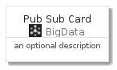
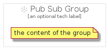

# PubSub


```text
gcp/Item/BigData/PubSub
```

```text
include('gcp/Item/BigData/PubSub')
```


| Illustration | PubSub | PubSubCard | PubSubGroup |
| :---: | :---: | :---: | :---: |
|  |  |  |  |


## PubSub

### Load remotely
```plantuml
@startuml
' configures the library
!global $LIB_BASE_LOCATION="https://raw.githubusercontent.com/tmorin/plantuml-libs/master/distribution"

' loads the library's bootstrap
!include $LIB_BASE_LOCATION/bootstrap.puml

' loads the package bootstrap
include('gcp/bootstrap')

' loads the Item which embeds the element PubSub
include('gcp/Item/BigData/PubSub')

' renders the element
PubSub('PubSub', 'Pub Sub', 'an optional tech label')
@enduml
```

### Load locally
```plantuml
@startuml
' configures the library
!global $INCLUSION_MODE="local"
!global $LIB_BASE_LOCATION="../../.."

' loads the library's bootstrap
!include $LIB_BASE_LOCATION/bootstrap.puml

' loads the package bootstrap
include('gcp/bootstrap')

' loads the Item which embeds the element PubSub
include('gcp/Item/BigData/PubSub')

' renders the element
PubSub('PubSub', 'Pub Sub', 'an optional tech label')
@enduml
```

## PubSubCard

### Load remotely
```plantuml
@startuml
' configures the library
!global $LIB_BASE_LOCATION="https://raw.githubusercontent.com/tmorin/plantuml-libs/master/distribution"

' loads the library's bootstrap
!include $LIB_BASE_LOCATION/bootstrap.puml

' loads the package bootstrap
include('gcp/bootstrap')

' loads the Item which embeds the element PubSubCard
include('gcp/Item/BigData/PubSub')

' renders the element
PubSubCard('PubSubCard', 'Pub Sub Card', 'an optional description')
@enduml
```

### Load locally
```plantuml
@startuml
' configures the library
!global $INCLUSION_MODE="local"
!global $LIB_BASE_LOCATION="../../.."

' loads the library's bootstrap
!include $LIB_BASE_LOCATION/bootstrap.puml

' loads the package bootstrap
include('gcp/bootstrap')

' loads the Item which embeds the element PubSubCard
include('gcp/Item/BigData/PubSub')

' renders the element
PubSubCard('PubSubCard', 'Pub Sub Card', 'an optional description')
@enduml
```

## PubSubGroup

### Load remotely
```plantuml
@startuml
' configures the library
!global $LIB_BASE_LOCATION="https://raw.githubusercontent.com/tmorin/plantuml-libs/master/distribution"

' loads the library's bootstrap
!include $LIB_BASE_LOCATION/bootstrap.puml

' loads the package bootstrap
include('gcp/bootstrap')

' loads the Item which embeds the element PubSubGroup
include('gcp/Item/BigData/PubSub')

' renders the element
PubSubGroup('PubSubGroup', 'Pub Sub Group', 'an optional tech label') {
    note as note
        the content of the group
    end note
}
@enduml
```

### Load locally
```plantuml
@startuml
' configures the library
!global $INCLUSION_MODE="local"
!global $LIB_BASE_LOCATION="../../.."

' loads the library's bootstrap
!include $LIB_BASE_LOCATION/bootstrap.puml

' loads the package bootstrap
include('gcp/bootstrap')

' loads the Item which embeds the element PubSubGroup
include('gcp/Item/BigData/PubSub')

' renders the element
PubSubGroup('PubSubGroup', 'Pub Sub Group', 'an optional tech label') {
    note as note
        the content of the group
    end note
}
@enduml
```

