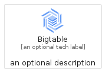
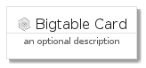
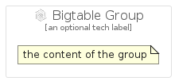

# Bigtable


```text
gcp/Item/Bigtable
```

```text
include('gcp/Item/Bigtable')
```


| Illustration | Bigtable | BigtableCard | BigtableGroup |
| :---: | :---: | :---: | :---: |
|  |  |  |  |


## Bigtable

### Load remotely
```plantuml
@startuml
' configures the library
!global $LIB_BASE_LOCATION="https://raw.githubusercontent.com/tmorin/plantuml-libs/master/distribution"

' loads the library's bootstrap
!include $LIB_BASE_LOCATION/bootstrap.puml

' loads the package bootstrap
include('gcp/bootstrap')

' loads the Item which embeds the element Bigtable
include('gcp/Item/Bigtable')

' renders the element
Bigtable('Bigtable', 'Bigtable', 'an optional tech label')
@enduml
```

### Load locally
```plantuml
@startuml
' configures the library
!global $INCLUSION_MODE="local"
!global $LIB_BASE_LOCATION="../.."

' loads the library's bootstrap
!include $LIB_BASE_LOCATION/bootstrap.puml

' loads the package bootstrap
include('gcp/bootstrap')

' loads the Item which embeds the element Bigtable
include('gcp/Item/Bigtable')

' renders the element
Bigtable('Bigtable', 'Bigtable', 'an optional tech label')
@enduml
```

## BigtableCard

### Load remotely
```plantuml
@startuml
' configures the library
!global $LIB_BASE_LOCATION="https://raw.githubusercontent.com/tmorin/plantuml-libs/master/distribution"

' loads the library's bootstrap
!include $LIB_BASE_LOCATION/bootstrap.puml

' loads the package bootstrap
include('gcp/bootstrap')

' loads the Item which embeds the element BigtableCard
include('gcp/Item/Bigtable')

' renders the element
BigtableCard('BigtableCard', 'Bigtable Card', 'an optional description')
@enduml
```

### Load locally
```plantuml
@startuml
' configures the library
!global $INCLUSION_MODE="local"
!global $LIB_BASE_LOCATION="../.."

' loads the library's bootstrap
!include $LIB_BASE_LOCATION/bootstrap.puml

' loads the package bootstrap
include('gcp/bootstrap')

' loads the Item which embeds the element BigtableCard
include('gcp/Item/Bigtable')

' renders the element
BigtableCard('BigtableCard', 'Bigtable Card', 'an optional description')
@enduml
```

## BigtableGroup

### Load remotely
```plantuml
@startuml
' configures the library
!global $LIB_BASE_LOCATION="https://raw.githubusercontent.com/tmorin/plantuml-libs/master/distribution"

' loads the library's bootstrap
!include $LIB_BASE_LOCATION/bootstrap.puml

' loads the package bootstrap
include('gcp/bootstrap')

' loads the Item which embeds the element BigtableGroup
include('gcp/Item/Bigtable')

' renders the element
BigtableGroup('BigtableGroup', 'Bigtable Group', 'an optional tech label') {
    note as note
        the content of the group
    end note
}
@enduml
```

### Load locally
```plantuml
@startuml
' configures the library
!global $INCLUSION_MODE="local"
!global $LIB_BASE_LOCATION="../.."

' loads the library's bootstrap
!include $LIB_BASE_LOCATION/bootstrap.puml

' loads the package bootstrap
include('gcp/bootstrap')

' loads the Item which embeds the element BigtableGroup
include('gcp/Item/Bigtable')

' renders the element
BigtableGroup('BigtableGroup', 'Bigtable Group', 'an optional tech label') {
    note as note
        the content of the group
    end note
}
@enduml
```

