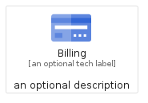
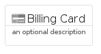
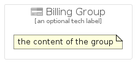

# Billing


```text
gcp/Item/Billing
```

```text
include('gcp/Item/Billing')
```


| Illustration | Billing | BillingCard | BillingGroup |
| :---: | :---: | :---: | :---: |
|  |  |  |  |


## Billing

### Load remotely
```plantuml
@startuml
' configures the library
!global $LIB_BASE_LOCATION="https://raw.githubusercontent.com/tmorin/plantuml-libs/master/distribution"

' loads the library's bootstrap
!include $LIB_BASE_LOCATION/bootstrap.puml

' loads the package bootstrap
include('gcp/bootstrap')

' loads the Item which embeds the element Billing
include('gcp/Item/Billing')

' renders the element
Billing('Billing', 'Billing', 'an optional tech label')
@enduml
```

### Load locally
```plantuml
@startuml
' configures the library
!global $INCLUSION_MODE="local"
!global $LIB_BASE_LOCATION="../.."

' loads the library's bootstrap
!include $LIB_BASE_LOCATION/bootstrap.puml

' loads the package bootstrap
include('gcp/bootstrap')

' loads the Item which embeds the element Billing
include('gcp/Item/Billing')

' renders the element
Billing('Billing', 'Billing', 'an optional tech label')
@enduml
```

## BillingCard

### Load remotely
```plantuml
@startuml
' configures the library
!global $LIB_BASE_LOCATION="https://raw.githubusercontent.com/tmorin/plantuml-libs/master/distribution"

' loads the library's bootstrap
!include $LIB_BASE_LOCATION/bootstrap.puml

' loads the package bootstrap
include('gcp/bootstrap')

' loads the Item which embeds the element BillingCard
include('gcp/Item/Billing')

' renders the element
BillingCard('BillingCard', 'Billing Card', 'an optional description')
@enduml
```

### Load locally
```plantuml
@startuml
' configures the library
!global $INCLUSION_MODE="local"
!global $LIB_BASE_LOCATION="../.."

' loads the library's bootstrap
!include $LIB_BASE_LOCATION/bootstrap.puml

' loads the package bootstrap
include('gcp/bootstrap')

' loads the Item which embeds the element BillingCard
include('gcp/Item/Billing')

' renders the element
BillingCard('BillingCard', 'Billing Card', 'an optional description')
@enduml
```

## BillingGroup

### Load remotely
```plantuml
@startuml
' configures the library
!global $LIB_BASE_LOCATION="https://raw.githubusercontent.com/tmorin/plantuml-libs/master/distribution"

' loads the library's bootstrap
!include $LIB_BASE_LOCATION/bootstrap.puml

' loads the package bootstrap
include('gcp/bootstrap')

' loads the Item which embeds the element BillingGroup
include('gcp/Item/Billing')

' renders the element
BillingGroup('BillingGroup', 'Billing Group', 'an optional tech label') {
    note as note
        the content of the group
    end note
}
@enduml
```

### Load locally
```plantuml
@startuml
' configures the library
!global $INCLUSION_MODE="local"
!global $LIB_BASE_LOCATION="../.."

' loads the library's bootstrap
!include $LIB_BASE_LOCATION/bootstrap.puml

' loads the package bootstrap
include('gcp/bootstrap')

' loads the Item which embeds the element BillingGroup
include('gcp/Item/Billing')

' renders the element
BillingGroup('BillingGroup', 'Billing Group', 'an optional tech label') {
    note as note
        the content of the group
    end note
}
@enduml
```

